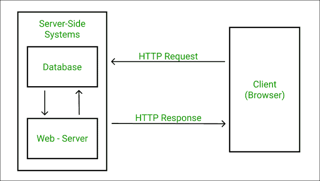
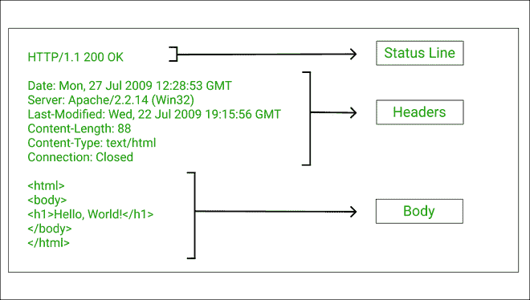

# 陈述 HTTP 响应的核心组件？

> 原文:[https://www . geesforgeks . org/state-the-the-core-components-of-a-http-response/](https://www.geeksforgeeks.org/state-the-core-components-of-an-http-response/)

您是否想过应用程序的前端如何与后端通信以获取数据或执行某些操作？这是通过应用编程接口请求完成的。应用编程接口代表应用编程接口。我们的客户端和应用编程接口之间的通信是使用 HTTP 请求实现的，请求之后是对客户端的响应。请求和响应都遵循一定的语法和结构，以简化通信过程。

每当我们的客户端应用程序想要与服务器通信时，它都会使用 HTTP 协议向服务器发送一条消息，这也被称为 HTTP 请求。基于该消息，服务器根据消息的要求执行某些操作，然后通过消息回复客户端，也称为 **HTTP 响应**。

下图描述了请求-响应周期:



HTTP 请求-响应周期的图像

**HTTP 响应的结构:**如上所述，HTTP 响应有一个特殊的结构，客户端可以很容易地理解它。有一种大家都遵循的通用语言，这样人与人之间就没有交流的鸿沟。HTTP 响应大体上有 3 个主要组件:

*   状态行
*   头球
*   车身(可选)

HTTP 响应整体如下图所示:



超文本传输协议响应剖析

让我们一个接一个地看一遍:

**状态行:**状态行的示例如下:

```html
HTTP/1.1 200 OK
```

状态行包含三个重要组件——HTTP 版本、HTTP 响应代码和原因短语。

*   **HTTP 版本:**HTTP 版本号显示服务器试图使响应消息符合的 HTTP 规范。在上面的例子中， **1.1** 是 HTTP 版本。
*   **HTTP 响应代码:**是一个 3 位数的数字，表示请求的结论。在上面的例子中，响应代码 **200** 表示请求的内容是可以的。我们经常遇到的一个非常流行的状态代码是 404，它表示未找到请求的资源。
*   **原因短语:**也称为状态文本，因为它以人类可读的形式总结了状态代码。

**响应头:**响应头包含作为响应返回的内容的相关信息以及发送它的服务器的相关数据。这些信息有助于客户端/浏览器决定响应数据的使用方式。换句话说，报头可以说是元数据，它与响应一起发送，以提供关于它的更多信息。

服务器可以根据需要发送任意多的邮件头。标头作为由冒号( : )分隔的键值对发送。虽然服务器可以根据需要发送任意多的报头，但最流行的响应报头是*内容长度、内容类型、日期、服务器、Set-Cookie* 、**、**、*等。*

```html
Date: Thu, 16 Jan 2016 08:16:18 GMT
Server: IBM_CICS_Transaction_Server/3.1.0(zOS)
Content-type: image/jpg
```

在上例中，响应头显示了发送响应的日期和时间、发送响应的服务器以及发送的内容类型，这里是一个 jpg 图像文件。

**正文:**在成功响应的情况下，响应消息的正文用于向客户端/用户提供请求中要求的资源。虽然正文是可选的，但它是客户机和服务器之间通信的最基本部分之一，并且大部分时间都是发送的。正文携带数据，可以是 *json、html、image* 、**T5*等多种格式中的一种。*在标题中有相应的说明。**

如果出现一些错误，主体可能会提供错误的原因或成功完成请求所需的操作。有时，它可能有一个链接来引导用户到其他页面。