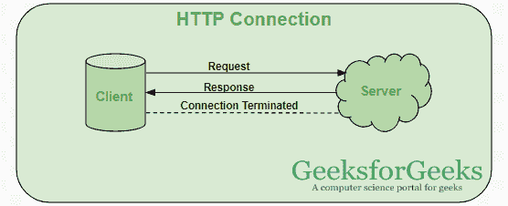
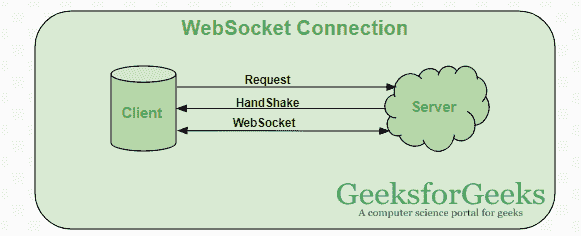

# 什么是网络套接字，它与 HTTP 有什么不同？

> 原文:[https://www . geesforgeks . org/什么是网络套接字及其与 http 的不同之处/](https://www.geeksforgeeks.org/what-is-web-socket-and-how-it-is-different-from-the-http/)

HTTP 和 WebSocket 都是客户端-服务器通信中使用的通信协议。

**HTTP 协议:** HTTP 是单向的，客户端发送请求，服务器发送响应。让我们举一个例子，当一个用户向服务器发送一个请求时，这个请求以 HTTP 或 HTTPS 的形式进行，在接收到一个请求后，服务器向客户端发送响应，每个请求都与一个相应的响应相关联，在发送响应后，连接被关闭，每个 HTTP 或 HTTPS 请求每次都与服务器建立新的连接，在获得响应后，连接自行终止。
HTTP 是无状态协议，运行在 TCP 之上，TCP 是一种面向连接的协议，它保证使用三方握手方法传输数据包，并重新传输丢失的数据包。

HTTP 可以运行在任何可靠的面向连接的协议之上，比如 TCP，SCTP。当客户机向服务器发送 HTTP 请求时，客户机和服务器之间的 TCP 连接是打开的，并且在获得响应后，TCP 连接被终止，每个 HTTP 请求打开到服务器的单独的 TCP 连接，例如，如果客户机向服务器发送 10 个请求，则 10 个单独的 TCP 连接将被打开。并在获得响应/回退后关闭。

HTTP 消息信息用 ASCII 编码，每个 HTTP 请求消息组成 HTTP 协议版本(HTTP/1.1、HTTP/2)、HTTP 方法(GET/POST 等)。)，HTTP 头(内容类型，内容长度)，主机信息等。和包含正在传输到服务器的实际消息的正文。HTTP 头的大小从 200 字节到 2 KB 不等，常见的 HTTP 头大小为 700-800 字节。当 web 应用程序在客户端使用更多的 cookies 和其他工具来扩展代理的存储功能时，它会减少 HTTP 头的负载。

**WebSocket:** WebSocket 是双向的，一种全双工协议，用于客户端-服务器通信的相同场景，与 HTTP 不同，它从 **ws://** 或 **wss://** 开始。它是一个有状态协议，这意味着客户端和服务器之间的连接将保持活动状态，直到被任何一方(客户端或服务器)终止。在客户端和服务器中的任何一方关闭连接后，连接从两端终止。

让我们举一个客户机-服务器通信的例子，有一个客户机，它是一个网络浏览器和一个服务器，每当我们启动客户机和服务器之间的连接时，客户机-服务器进行握手并决定创建一个新的连接，这个连接将保持活动状态，直到被其中任何一个终止。当连接建立并且有效时，通信使用相同的连接信道进行，直到它被终止。

这就是在客户机-服务器握手之后，客户机-服务器如何决定一个新的连接来保持它的活力，这个新的连接将被称为 WebSocket。一旦通信链路建立和连接打开，消息交换将以双向模式进行，直到客户机-服务器之间的连接持续。如果其中任何一方(客户端-服务器)死亡或决定关闭连接，则由双方关闭。套接字的工作方式与 HTTP 的工作方式略有不同，状态代码 101 表示网络套接字中的交换协议。

**什么时候可以使用网络插座:**

*   **Real-time web application:** Real-time web application uses a web socket to show the data at the client end, which is continuously being sent by the backend server. In WebSocket, data is continuously pushed/transmitted into the same connection which is already open, that is why web socket is faster and improves the application performance. 

    例如，在交易网站或比特币交易中，这是那里正在发生的最不稳定的事情，因为显示价格波动和移动数据是由后端服务器通过使用网络套接字通道连续推送到客户端的。

*   **游戏应用:**在一个游戏应用中，你可能会关注到，数据是由服务器持续接收的，不刷新 UI，它会在屏幕上生效，UI 会自动刷新，甚至不建立新的连接，所以在一个游戏应用中非常有帮助。
*   **聊天应用:**聊天应用使用 WebSocket 仅建立一次连接，用于在订阅者之间交换、发布和广播消息。它重用相同的 WebSocket 连接，用于发送和接收消息以及一对一的消息传输。

**何时不使用网络套接字:**如果我们想要通过网络传输任何实时更新或连续的数据流，可以使用网络套接字。如果我们想要获取旧数据，或者想要只获取一次数据就用一个应用程序来处理它，我们应该使用 **HTTP 协议**，不需要很频繁或者只获取一次的旧数据可以通过简单的 HTTP 请求来查询，所以在这种情况下最好不要使用 WebSocket。

**注意:**如果我们只加载一次数据，RESTful web 服务足以从服务器获取数据。

**HTTP 与 WebSocket 连接的区别:**

<figure class="table">

| web 套接字连接 | HTTP connection |
| WebSocket is a two-way communication protocol. By reusing the established connection channel, data can be sent from the client to the server or from the server to the client. Keep the connection alive until it is terminated by the client or server. | HTTP protocol is a one-way protocol that works on TCP protocol, and TCP protocol is a connection-oriented transport layer protocol. After receiving the response, we can use HTTP request method to create a connection and the HTTP connection is closed. |
| Almost all real-time applications like (transaction, monitoring and notification) services use WebSocket to receive data on a single communication channel. | Simple RESTful applications use stateless HTTP protocol. |
| All frequently updated applications use WebSocket because it is faster than HTTP Connection. | HTTP connection is slower than WebSocket when we don't want to keep a connection for a certain time or reuse a single connection to transmit data. .. |

</figure>

**注意:**根据您的项目，您必须选择它将是 WebSocket 还是 HTTP Connection。