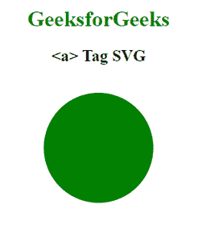
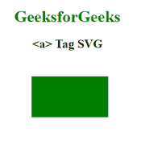

# SVG `<a>`元素

> 原文:[https://www.geeksforgeeks.org/svg-a-element/](https://www.geeksforgeeks.org/svg-a-element/)

SVG 中的**“<a>“**元素用于创建指向其他网页或任何 URL 的超链接。该标签的工作方式与 HTML“<a>”标签相同。

**语法:**

```html
<a href="" 
   target="" 
   type="" 
   rel="" 
   download=""></a>

```

**属性:**

*   **href:** 代表超文本引用，并带有其他文档的链接。**T3】**
*   **下载:**指示浏览器下载文件。
*   **hreflang:** 超链接指向的是 URL 的人类语言，或者简单的说是 URL 片段，就是 hreflang。
*   **rel:** 它讲述了目标文档和源文档之间的关系。
*   **目标:**告知网页显示的位置。
*   **类型:**它讲述了与 URL 链接的文档的 MIME 类型。
*   **ping:** 是用空格分隔的 URL 列表。

下面给出了上述函数的几个例子。

**例 1:**

```html
<!DOCTYPE html> 
<html lang="en"> 
    <head> 
        <meta charset="UTF-8" /> 
        <meta
            property="viewport"
            content="width=device-width, 
                    initial-scale=1.0"/> 
        <title>GeeksforGeeks</title> 
    </head>
    <body> 
        <div style="width:300px; height:300px;">
            <center>
                <h1 style="color:green">
                    GeeksforGeeks
                </h1> 
                <h2>
                    <a> Tag SVG
                </h2> 
            </center>
            <svg width="500" height="500">
                <a href="http://geeksforgeeks.org">
                    <circle cx="150" cy="100"
                            r="80" fill="green">
                </a>
            </svg>
        </div>
    </body> 
</html>
```

**输出:**

[](https://media.geeksforgeeks.org/wp-content/uploads/20200826110805/01-272x300.PNG)

**例 2:**

```html
<!DOCTYPE html> 
<html lang="en"> 
    <head> 
        <meta charset="UTF-8" /> 
        <meta
            property="viewport"
            content="width=device-width, 
                    initial-scale=1.0"/> 
        <title>GeeksforGeeks</title> 
    </head>
    <body> 
        <div style="width:300px; height:300px;">
            <center>
                <h1 style="color:green">
                    GeeksforGeeks
                </h1> 
                <h2>
                    <a> Tag SVG
                </h2> 
            </center>
            <svg width="500" height="500">
                <a href="http://geeksforgeeks.org">
                    <rect x="80" y="30" width="150"
                          height="80" fill="green">
                </a>
            </svg>
        </div>
    </body> 
</html>
```

**输出:**

[](https://media.geeksforgeeks.org/wp-content/uploads/20200826111005/01-185x200.PNG)

**支持的浏览器:**此 SVG 元素支持以下浏览器:

*   铬
*   边缘
*   火狐浏览器
*   微软公司出品的 web 浏览器
*   旅行队
*   歌剧