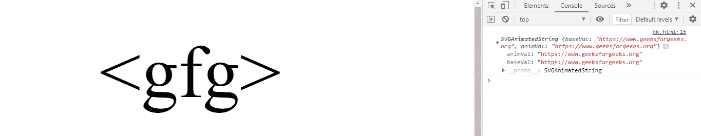

# SVG 自由贸易。href 属性

> 原文:[https://www.geeksforgeeks.org/svg-aelement-href-property/](https://www.geeksforgeeks.org/svg-aelement-href-property/)

**SVG AElement.href 属性**返回一个对应于给定 A 元素属性的 SVGAnimatedLength 对象

**语法:**

```html
AElement.href
```

**返回值:**该属性返回 SVGAnimatedLength 对象，该对象可用于获取元素的 href。

**例 1:**

```html
<!DOCTYPE html>
<html>

<body>
    <svg viewBox="0 0 100 100" 
        xmlns="http://www.w3.org/2000/svg">

        <!-- A link around a shape -->
        <a href="https://www.geeksforgeeks.org" id="gfg">
            <circle cx="20" cy="40" r="15" />
        </a>

        <script>
            var g = document.getElementById("gfg");
            console.log(g.href);
        </script>
    </svg>
</body>

</html>
```

**输出:**


**例 2:**

```html
<!DOCTYPE html>
<html>

<body>
    <svg viewBox="0 0 100 100" 
        xmlns="http://www.w3.org/2000/svg">

        <!-- A link around a text -->
        <a href="https://www.geeksforgeeks.org" id="gfg">
            <text x="40" y="20" text-anchor="middle">
                <gfg>
            </text>
        </a>

        <script>
            var g = document.getElementById("gfg");
            console.log(g.href);
        </script>
    </svg>
</body>

</html>
```

**输出:**



**参考:**[https://developer . Mozilla . org/en-US/docs/Web/API/SVGAElement](https://developer.mozilla.org/en-US/docs/Web/API/SVGAElement)