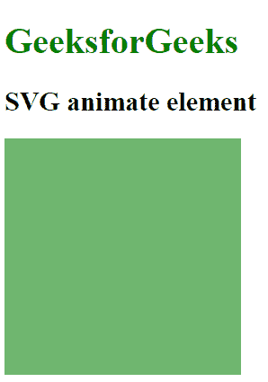

# SVG `<animate>`元素

> 原文:[https://www.geeksforgeeks.org/svg-animate-element/](https://www.geeksforgeeks.org/svg-animate-element/)

SVG 代表可缩放矢量图形。它可以用来制作像在 HTML 画布中的图形和动画。

**<动画>** SVG 元素用于随着时间的推移动画化元素的属性或特性。它通常被插入到我们想要制作动画的元素中。

**语法:**

```html
<animate attributeName="" values="" dur="" repeatCount="" />
```

**属性:**

*   **动画属性:**用于赋予动画效果、exp 计时属性、事件属性、数值属性等的属性。
*   **全局属性:**使用了一些全局属性，如核心属性、造型属性等。

以下是上述要素的几个例子:

**例 1:**

```html
<!DOCTYPE html>
<html>

<body>
    <svg viewBox="0 0 50 50">
        <rect width="10" height="10" fill="green">
            <animate attributeName="rx" values="0;20;0"
                dur="2s" repeatCount="10" />
        </rect>
    </svg>
</body>

</html>
```

**输出:**


**例 2:**

```html
<!DOCTYPE html>
<html>

<body>
    <h1 style="color:green"> 
        GeeksforGeeks 
    </h1>  
    <h2> 
        SVG animate element 
    </h2>  
    <svg viewBox="0 0 50 50">
        <rect width="7" height="7" fill="green">
            <animate attributeType="CSS" attributeName="opacity" 
           from="1" to="0" dur="4s" repeatCount="indefinite" />
        </rect>
    </svg>
</body>

</html>
```

**输出:**



**支持的浏览器:**此 SVG 元素支持以下浏览器:

*   铬
*   边缘
*   火狐浏览器
*   旅行队
*   歌剧