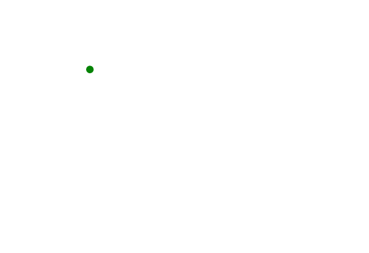

# SVG `<animateMotion>`元素

> 原文:[https://www.geeksforgeeks.org/svg-animatemotion-element/](https://www.geeksforgeeks.org/svg-animatemotion-element/)

SVG 代表可缩放矢量图形。它可以用来制作像在 HTML 画布中的图形和动画。

SVG `<strong>` <动画情感>元素用于定义元素如何沿着运动路径移动。

**语法:**

```html
<animateMotion values="" dur="" repeatCount="" path="" />
```

**属性:**

*   **关键点:**该属性指示在[0，1]范围内，对象沿着每个关键时间关联值的路径有多远。
*   **路径:**该属性定义运动的路径。
*   **旋转:**该属性定义了应用于沿路径动画化的元素的旋转，通常使其指向动画的方向。
*   **动画属性:**用于赋予动画效果、exp 计时属性、事件属性、数值属性等的属性。
*   **全局属性:**使用了一些全局属性，如核心属性、造型属性等。

**示例:**

```html
<!DOCTYPE html>
<html>

<body>
    <svg width="1200" height="1200">
        <circle cx="60" cy="60" r="5" fill="green">
            <animateMotion dur="10s" repeatCount="indefinite"
          path="M20, 60 C20,
                -50 180, 150 180,
                 60 C180-60 20,
                 150 20, 60 z" />
        </circle>
    </svg>
</body>

</html>
```

**输出:**



**支持的浏览器:**此 SVG 元素支持以下浏览器:

*   铬
*   边缘
*   火狐浏览器
*   旅行队
*   歌剧