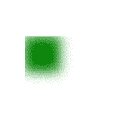

# SVG 模糊效果

> 原文:[https://www.geeksforgeeks.org/svg-blur-effects/](https://www.geeksforgeeks.org/svg-blur-effects/)

SVG <fegaussianblur>元素用于创建模糊效果:</fegaussianblur>

**语法:**

```html
<feGaussianBlur in="SourceGraphic" stdDeviation="5" />
```

**属性:**

*   中的**用于识别给定过滤器原语的输入。**
*   **标准差:**用于定义模糊操作的标准差。
*   **边缘模式:**用于根据需要确定如何用颜色值扩展输入图像。

**示例:**

```html
<!DOCTYPE html>
<html>
<body>

<svg height="400" width="400">
  <defs>
    <filter id="gfgid" x="0.5" y="0.5">
      <feGaussianBlur in="SourceGraphic"
                      stdDeviation="10" />
    </filter>
  </defs>

  <rect width="120" height="120"
        stroke="green" stroke-width="4"
        fill="green" filter="url(#gfgid)" />
</svg>

</body>
</html>
```

**输出:**



**示例:**自定义模糊圆。

```html
<!DOCTYPE html>
<html>
<body>

<svg height="400" width="400">
  <defs>
    <filter id="gfgid" x="0" y="0">
      <feGaussianBlur in="SourceGraphic"
                      stdDeviation="05" />
    </filter>
  </defs>

        <circle cx="40" cy="40" r="50"
                stroke="black" stroke-width="2"
                fill="grey" filter="url(#gfgid)"/> 
  </svg>

</body>
</html>
```

**输出:**

