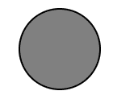
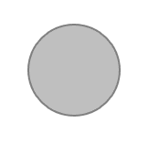

# SVG 圆

> 哎哎哎:# t0]https://www . geeksforgeeks . org/SVG-circle/

SVG <circle>元素用于画圆。给出了中心点和半径。</circle>

**语法:**

```html
<circle
   cx="x-axis co-ordinate"
   cy="y-axis co-ordinate"
   r="length" >   
</circle>
```

**属性:**

*   **cx:** 中心的 x 轴坐标。
*   **cy:** 中心的 y 轴坐标
*   **r:** 圆的半径。

**示例:**

```html
<!DOCTYPE html>
<html>
    <body>
        <svg width="200" height="200">
            <circle cx="80" cy="80" r="50" 
                    stroke="black" 
                    stroke-width="2" 
                    fill="grey" />
        </svg>
    </body>
</html>
```

**输出:**



**示例:**更改运营成本

```html
<!DOCTYPE html>
<html>
    <body>
        <svg width="200" height="200">
            <circle cx="80" cy="80"
                    r="50" stroke="black" 
                    stroke-width="2" 
                    fill="grey"
                    opacity="0.5" />
        </svg>
    </body>
</html>
```

**输出:**

