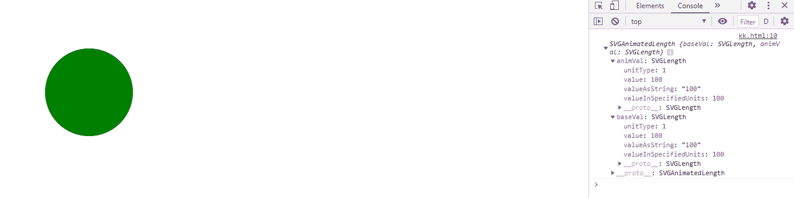
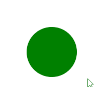

# SVG 循环元素. cx 属性

> 原文:[https://www . geesforgeks . org/SVG-circle element-CX-property/](https://www.geeksforgeeks.org/svg-circleelement-cx-property/)

SVG **CircleElement.cx 属性** 返回一个对应于给定 lin e 元素属性的 SVGAnimatedLength 对象。

**语法:**

```html
CircleElement.cx
```

**返回值:**这个属性返回 SVGAnimatedLength 对象，可以用来获取圆元素的 cx。

**例 1:**

```html
<!DOCTYPE html>
<html>

<body>
    <svg xmlns="http://www.w3.org/2000/svg"
        viewBox="0 0 250 250" width="250" 
        height="250">

        <circle cx="100" cy="100" r="50" 
            fill="green" id="gfg" 
            onclick="clickCircle();" />

        <script>
            var g = document.getElementById("gfg");
            console.log(g.cx)
        </script>
    </svg>
</body>

</html>
```

**输出:**



**例 2:**

## 超文本标记语言

```html
<!DOCTYPE html>
<html>

<body>
    <svg xmlns="http://www.w3.org/2000/svg"
        viewBox="0 0 250 250" width="250" 
        height="250">

        <circle cx="100" cy="100" r="50" 
            fill="green" class="gfg" 
            onclick="clickCircle();" />

        <script>
            function clickCircle() {
                var g = document.querySelector(".gfg");
                document.write("cx value of the circle is : ",
                    g.cx.animVal.value);
            }
        </script>
    </svg>
</body>

</html>
```

**输出:**

