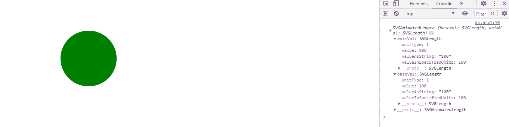
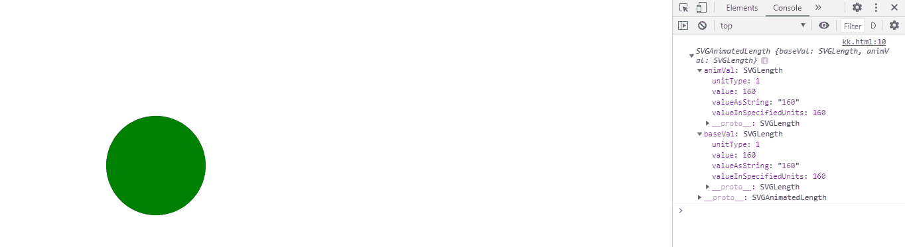

# SVG 循环元素属性

> 原文:[https://www . geesforgeks . org/SVG-circle element-cy-property/](https://www.geeksforgeeks.org/svg-circleelement-cy-property/)

**SVG CircleElement.cy 属性** 返回一个对应于给定 lin e 元素属性的 SVGAnimatedLength 对象。

**语法:**

```html
CircleElement.cy
```

**返回值:**该属性返回svorganimatedlength 对象，该对象可用于获取圆元素的 cy

**例 1:**

## 超文本标记语言

```html
<!DOCTYPE html>
<html>

<body>
    <svg xmlns="http://www.w3.org/2000/svg" 
         viewBox="0 0 250 250" width="250" height="250">
      <circle cx="150" cy="100" r="50" fill="green" 
              id="gfg" onclick="clickCircle();"/>
      <script>
        var g = document.getElementById("gfg");
                console.log(g.cy)
      </script>
    </svg>
</body>

</html>
```

**输出:**



**例 2:**

## 超文本标记语言

```html
<!DOCTYPE html>
<html>

<body>
    <svg xmlns="http://www.w3.org/2000/svg" 
         viewBox="0 0 250 250" width="250" height="250">
      <circle cx="150" cy="160" r="50" fill="green" 
              id="gfg" onclick="clickCircle();"/>
      <script>
        var g = document.getElementById("gfg");
                console.log(g.cx)
      </script>
    </svg>
</body>

</html>
```

**输出:**

