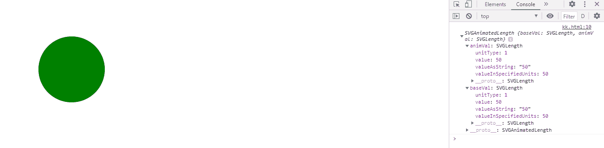
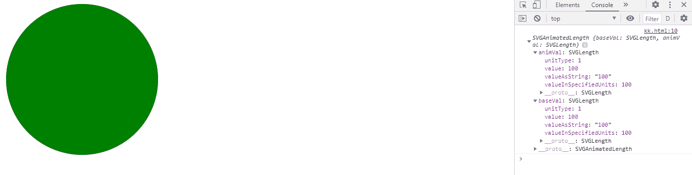

# SVG 循环元件属性

> 原文:[https://www.geeksforgeeks.org/svg-circleelement-r-property/](https://www.geeksforgeeks.org/svg-circleelement-r-property/)

SVG 代表可缩放矢量图形。它可以用来制作像在 HTML 画布中的图形和动画。

SVG **CircleElement r 属性** r 返回一个对应于给定 lin e 元素属性的 SVGAnimatedLength 对象

**语法:**

```html
CircleElement.r

```

**返回值:**该属性返回svorganimatedlength 对象，可用于获取圆元素的其余部分

**例 1:**

## 超文本标记语言

```html
<!DOCTYPE html>
<html>

<body>
    <svg xmlns="http://www.w3.org/2000/svg" 
        viewBox="0 0 250 250" width="250" 
        height="250">

        <circle cx="100" cy="100" r="50" 
            fill="green" id="gfg" 
            onclick="clickCircle();" />

        <script>
            var g = document.getElementById("gfg");
            console.log(g.r)
        </script>
    </svg>
</body>

</html>
```

**输出:**



**例 2:**

## 超文本标记语言

```html
<!DOCTYPE html>
<html>

<body>
    <svg xmlns="http://www.w3.org/2000/svg" 
        viewBox="0 0 250 250" width="250" 
        height="250">

        <circle cx="100" cy="100" r="100" 
            fill="green" id="gfg" 
            onclick="clickCircle();" />

        <script>
            var g = document.getElementById("gfg");
            console.log(g.r)
        </script>
    </svg>
</body>

</html>
```

**输出:**

