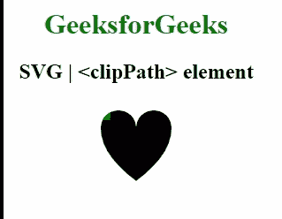
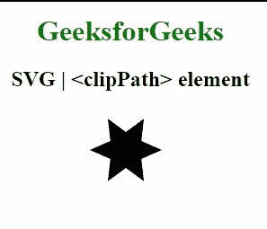

# SVG `<clipPath>`元素

> 原文:[https://www.geeksforgeeks.org/svg-clippath-element/](https://www.geeksforgeeks.org/svg-clippath-element/)

**<剪辑路径>** SVG 元素用于定义剪辑路径属性要使用的剪辑路径。它的工作原理与 CSS 中的剪辑路径相同。

剪辑路径用于对一个区域进行一些限制，这样在该区域之外绘制的任何东西都将既不可见也不会被绘制。

**语法:**

```html
<clipPath></clipPath>

```

**属性:**

*   **剪辑路径单位:**该属性定义了& lt 的坐标系；剪辑路径&gt；元素的内容。

下面是上面给出的函数的几个例子。

**例 1:**

```html
<!DOCTYPE html>
<html lang="en">
    <head>
        <meta charset="UTF-8" />
        <meta
            property="viewport"
            content="width=device-width, 
                    initial-scale=1.0"
        />
        <title>GeeksforGeeks</title>
    </head>
    <style>
        @keyframes animation1 {
            from {
                width: 4px;
                height: 4px;
            }
            to {
                width: 150px;
                height: 150px;
            }
        }

        rect {
            animation: animation1 10s ease-in-out;
        }
    </style>
    <body>
        <div style="width: 300px; height: 300px;">
            <center>
                <h1 style="color: green;">
                    GeeksforGeeks
                </h1>
                <h2>
                    SVG | <clipPath> element
                </h2>
            </center>

            <svg width="500"
                 height="500" 
                 transform="translate(100, 0)">
                <clipPath id="gfg">
                    <rect width="4"
                          height="4"></rect>
                </clipPath>
                <path id="path" 
                      d="M10, 30 A20, 20, 0, 0,
                         1, 50, 30 A20, 20, 0, 0, 1,
                         90, 30 Q90, 60, 50, 90 Q10, 
                         60, 10, 30 Z" />
                <use fill="green"
                     clip-path="url(#gfg)"
                     href="#path" />
            </svg>
        </div>
    </body>
</html>
```

**输出:**

[](https://media.geeksforgeeks.org/wp-content/uploads/20200826153754/clippath.gif)

**例 2:**

```html
<!DOCTYPE html> 
<html lang="en"> 
    <head> 
        <meta charset="UTF-8" /> 
        <meta
            property="viewport"
            content="width=device-width, 
                    initial-scale=1.0"/> 
        <title>GeeksforGeeks</title> 
    </head>
    <style>
        @keyframes star {from {r: 0} to {r: 500px}}

        #gfg circle {
        animation: star 25s ease;
        }
    </style>
    <body> 
        <div style="width:300px; height:300px;">
            <center>
                <h1 style="color:green">
                    GeeksforGeeks
                </h1> 
                <h2>
                    <a> Tag SVG
                </h2> 
            </center>

            <svg width="500" height="500" 
                 transform="translate(60, -40)">
                <clipPath id="gfg">
                  <circle>
                </clipPath>
                <path id="star" d="
                M 85.000 105.000
                L 105.000 119.641
                L 102.321 95.000
                L 125.000 85.000
                L 102.321 75.000
                L 105.000 50.359
                L 85.000 65.000
                L 65.000 50.359
                L 67.679 75.000
                L 45.000 85.000
                L 67.679 95.000
                L 65.000 119.641
                z
                "/>
                <use clip-path="url(#gfg)" 
                     href="#star" fill="red" />
            </svg>
        </div>
    </body> 
</html>
```

**输出:**

[](https://media.geeksforgeeks.org/wp-content/uploads/20200826153540/clippath2.gif)

**支持的浏览器:**此 SVG 元素支持以下浏览器:

*   铬
*   边缘
*   火狐浏览器
*   微软公司出品的 web 浏览器
*   旅行队
*   歌剧