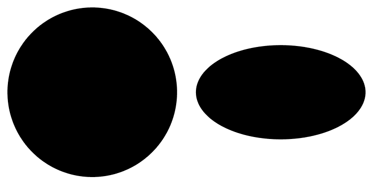

# SVG cx 属性

> 原文:[https://www.geeksforgeeks.org/svg-cx-attribute/](https://www.geeksforgeeks.org/svg-cx-attribute/)

**cx** 属性定义中心点的 x 轴坐标。

**语法:**

```html
cx="x-centre"
```

**属性值:**

*   **长度:**我们要设置 cx 坐标的长度。
*   **百分比:**我们要设置 cx 坐标的百分比。

我们将使用 cx 属性来设置 cx 坐标。

**例 1:**

```html
<!DOCTYPE html> 
<html> 

<body> 
    <svg viewBox="0 0 350 300" 
         xmlns="http://www.w3.org/2000/<svg 
         viewBox="0 0 300 100
         xmlns="http://www.w3.org/2000/svg">

        <circle cx="50" cy="50" r="45"/>
        <ellipse cx="150" cy="50" rx="45" ry="25" />

    </svg>
</body> 

</html>
```

**输出:**



**例 2:**

```html
<!DOCTYPE html> 
<html> 

<body> 
    <svg viewBox="0 0 350 300" 
         xmlns="http://www.w3.org/2000/<svg 
         viewBox="0 0 300 100 
         xmlns="http://www.w3.org/2000/svg">

        <circle cx="10%" cy="12%" r="9%"/>
        <ellipse cx="30%" cy="12%" rx="9%" ry="5%" />

    </svg>
</body> 

</html>
```

**输出:**

