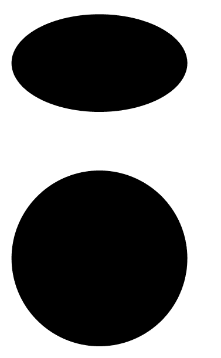

# SVG cy asttribute

> 哎哎哎:# t0]https://www . geeksforgeeks . org/SVG-cy-asttribute/

**cy** 属性定义中心点的 y 轴坐标。

**语法:**

```html
cyx="y-centre"
```

**属性值:**

*   **长度:**我们要设置 cy 坐标的长度。
*   **百分比:**我们要设置 cy 坐标的百分比。

我们将使用 cy 属性来设置 cy 坐标。

**例 1:**

```html
<!DOCTYPE html> 
<html> 

<body> 
    <svg viewBox="0 0 400 300" 
         xmlns="http://www.w3.org/2000/<svg viewBox=
         "0 0 300 100 
         xmlns="http://www.w3.org/2000/svg">

        <circle cx="50" cy="150" r="45"/>
        <ellipse cx="50" cy="50" rx="45" ry="25" />
    </svg>
</body> 

</html>
```

**输出:**



**例 2:**

```html
<!DOCTYPE html> 
<html> 

<body> 
    <svg viewBox="0 0 350 300" 
         xmlns="http://www.w3.org/2000/<svg 
         viewBox="0 0 300 100 
         xmlns="http://www.w3.org/2000/svg">

        <circle cx="12%" cy="10%" r="9%"/>
        <ellipse cx="12%" cy="30%" rx="9%" ry="5%" />

    </svg>
</body> 

</html>
```

**输出:**

