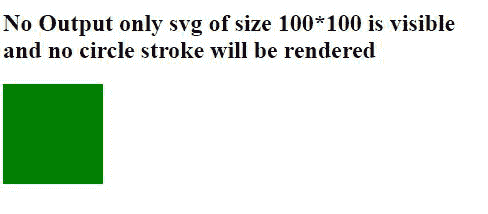
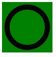

# SVG defs 元素

> 原文:[https://www.geeksforgeeks.org/svg-defs-element/](https://www.geeksforgeeks.org/svg-defs-element/)

SVG 中的 **<定义>** 在我们希望某个特定元素仅在需要时或被调用时渲染时使用。在 **<定义>** 元素内创建的对象不直接渲染，它们需要被<调用，使用>元素在浏览器上渲染它们。

**语法:**

```html
<defs></defs>

```

**属性值:**没有任何属性值。

下面给出了上述函数的几个例子。

**例 1:** 当<定义>未被调用时，不执行。

## 超文本标记语言

```html
<!DOCTYPE html>
<html lang="en">
<head>
  <meta charset="UTF-8">
  <meta name="viewport" 
        content="width=device-width, initial-scale=1.0">
  <title>Document</title>
</head>
<style>
  svg{
    background-color: green;
  }
</style>
<body> 
  <h2>
    No Output only svg of size 100*100 is visible<br>
    and no circle stroke will be rendered</h2>
  <svg width="100px" height="100px">

    <!--this defs code will not be 
        executed as it is not called-->
    <defs>
      <circle cx="50" cy="50" r="40" 
              stroke="black"/>
    </defs>
  </svg>
</body>
</html>
```

**输出:**



**例 2:**

## 超文本标记语言

```html
<!DOCTYPE html>
<html lang="en">
<head>
  <meta charset="UTF-8">
  <meta name="viewport" 
        content="width=device-width, initial-scale=1.0">
  <title>Document</title>
</head>
<style>
  svg{
    background-color: green;
  }
</style>
<body> 
  <svg width="100px" height="100px">
    <defs>
      <circle id="ele" cx="50" cy="50" 
              r="40" stroke="black" 
              stroke-width="10"/>
    </defs>

    <!-- this defs code will not be executed 
         as it is not called using use -->
    <defs>
      <circle id="ele" cx="50" cy="50"
              r="40" stroke="black"/>
    </defs>
    <use xlink:href="#ele" 
         fill="url('#myGradient')" />
  </svg>
</body>
</html>
```

**输出:**

