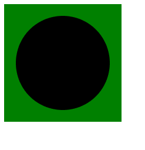

# SVG `<desc>`元素

> 哎哎哎:# t0]https://www . geeksforgeeks . org/SVG-desc 元素/

SVG 中的**<【desc】>**元素用于为任何可用的 SVG 元素提供可访问的文本描述，无论它是容器还是图形元素。

**语法:**

```html
<desc></desc>
```

**属性值:**没有任何属性值。

下面是上面给出的函数的几个例子。

**示例 1:** 当 desc 内部的文本以圆形元素给出时。

```html
<!DOCTYPE html> 
<html lang="en"> 
<head> 
    <meta charset="UTF-8"> 
    <meta name="viewport"
            path1tent="width=device-width, 
                    initial-scale=1.0"> 
    <title>Document</title> 
</head> 
<style> 
svg{
    width: 200px;
    height: 200px;
    color: #ffffff;
    background-color: green;
}
</style> 
<body>  
    <svg>
        <circle cx="100" 
                cy="100" 
                r="80">
          <desc>
            Geeks for geeks
          </desc>
        </circle>
      </svg>
</body> 
</html>
```

**输出:**请注意，输出中没有显示文本。



**示例 2:** 当 desc 内部的文本以矩形元素给出时。

```html
<!DOCTYPE html> 
<html lang="en"> 
<head> 
    <meta charset="UTF-8"> 
    <meta name="viewport"
            path1tent="width=device-width, 
                    initial-scale=1.0"> 
    <title>Document</title> 
</head> 
<style> 
svg{
    width: 200px;
    height: 200px;
    color: black;
    background-color: green;
}
</style> 
<body>  
    <svg>
        <rect aria-describedby="info" 
              width="180" height="100" 
              x="10" 
              y="50" 
              fill="white" 
              stroke="black">
            <desc id="info">
                Geeks for geeks
            </desc>
        </rect>
    </svg>
</body> 
</html>
```

**输出:**

