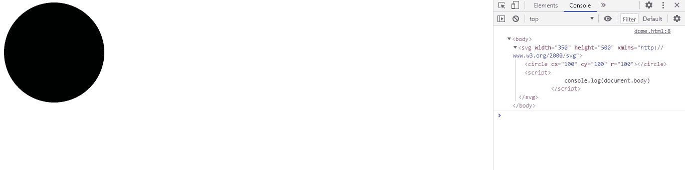

# SVG 文档体属性

> 原文:[https://www.geeksforgeeks.org/svg-document-body-property/](https://www.geeksforgeeks.org/svg-document-body-property/)

**SVG 文档体属性** r 表示包含文档体信息的对象。

**语法:**

```html
const objRef = document.body
```

**返回值:**这个属性 r 返回一个包含文档主体信息的对象。

**例 1:**

## 超文本标记语言

```html
<!DOCTYPE html> 
<html> 

<body> 
    <svg width="350" height="500" 
        xmlns="http://www.w3.org/2000/svg">
        <circle cx='100' cy='100'r="100"></circle>

        <script>
            console.log(document.body)
        </script>
    </svg>
</body> 

</html>
```

**输出:**



**例 2:**

## 超文本标记语言

```html
<!DOCTYPE html> 
<html> 

<body> 
    <svg width="500" height="500" 
        xmlns="http://www.w3.org/2000/svg">

        <text x='100' y='100' font-size="50px">
            GeeksforGeeks
        </text>

        <script>
            console.log(document.body)
        </script>
    </svg>
</body> 

</html>
```

**输出:**

