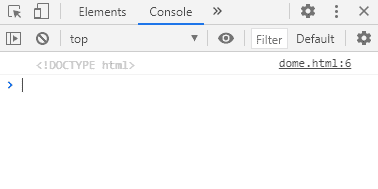

# SVG 文档类型属性

> 原文:[https://www . geesforgeks . org/SVG-document-doctype-property/](https://www.geeksforgeeks.org/svg-document-doctype-property/)

SVG `<em>` Document.doctype 属性返回文档的 *doctype* 。

**语法:**

```html
doctype = document.doctype

```

**返回值:**该属性返回文档的文档类型。

**示例:**

## 超文本标记语言

```html
<!DOCTYPE html> 
<html> 

<body> 
    <svg width="350" height="500" 
        xmlns="http://www.w3.org/2000/svg">

        <script>
            console.log(document.doctype)
        </script>
    </svg>
</body>

</html> 
```

**输出:**

