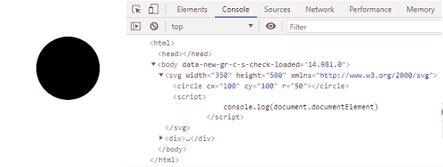
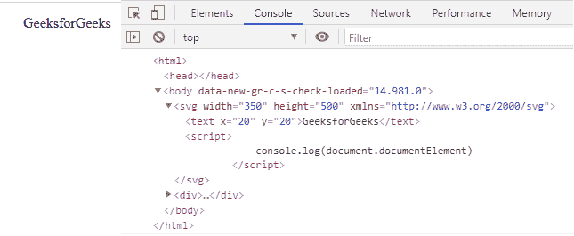

# SVG 文档.文档元素属性

> 原文:[https://www . geesforgeks . org/SVG-document-document element-property/](https://www.geeksforgeeks.org/svg-document-documentelement-property/)

SVG`<em>`document . document element 属性返回文档的根元素。

**语法:**

```html
const element = document.documentElement

```

**返回值:**该属性返回文档的根元素。

**例 1:**

## 超文本标记语言

```html
<!DOCTYPE html>
<html>

<body>
    <svg width="350" height="500" 
        xmlns="http://www.w3.org/2000/svg">

        <circle cx="100" cy="100" r="50"></circle>

        <script>
            console.log(document.documentElement)
        </script>
    </svg>
</body>

</html>
```

**输出:**



**例 2:**

## 超文本标记语言

```html
<!DOCTYPE html>
<html>

<body>
    <svg width="350" height="500" 
        xmlns="http://www.w3.org/2000/svg">

        <text x="20" y="20">GeeksforGeeks</text>

        <script>
            console.log(document.documentElement)
        </script>
    </svg>
</body>

</html>
```

**输出:**

