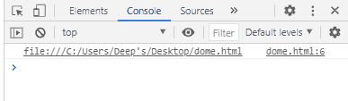

# SVG Document.documentURI 属性

> 原文:[https://www . geesforgeks . org/SVG-document-document uri-property/](https://www.geeksforgeeks.org/svg-document-documenturi-property/)

SVG `<em>` Document.documentURI 属性以字符串形式返回文档位置。

**语法:**

```html
const *uri* = *document*.documentURI

```

**返回值:**该属性以字符串形式返回文档位置。

**示例:**

## 超文本标记语言

```html
<!DOCTYPE html>
<html>

<body>
    <svg width="350" height="500" 
        xmlns="http://www.w3.org/2000/svg">

        <script>
            console.log(document.documentURI)
        </script>
    </svg>
</body>

</html>
```

**输出:**

