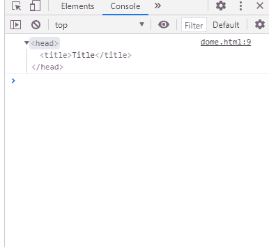
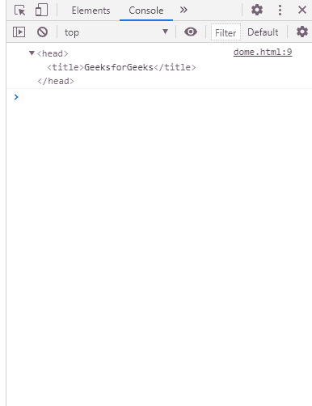

# SVG 文件头属性

> 原文:[https://www.geeksforgeeks.org/svg-document-head-property/](https://www.geeksforgeeks.org/svg-document-head-property/)

**SVG Document.head 属性** r 返回一个包含文档头信息的对象。

**语法:**

```html
var objRef = document.head
```

**返回值:**这个属性 r 返回一个包含文档头部信息的对象。

**例 1:**

## 超文本标记语言

```html
<!DOCTYPE html> 
<html> 
<head>
    <title>Title</title>
</head>
<body> 
    <svg width="350" height="500" 
        xmlns="http://www.w3.org/2000/svg">

        <script>
            console.log(document.head)
        </script>
    </svg>
</body> 

</html>
```

**输出:**



**例 2:**

## 超文本标记语言

```html
<!DOCTYPE html> 
<html> 
<head>
    <title>GeeksforGeeks</title>
</head>
<body> 
    <svg width="350" height="500" 
        xmlns="http://www.w3.org/2000/svg">

        <script>
            console.log(document.head)
        </script>
    </svg>
</body> 

</html>
```

**输出:**

