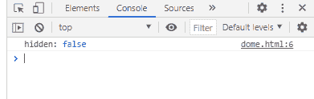

# SVG 文档隐藏属性

> 原文:[https://www.geeksforgeeks.org/svg-document-hidden-property/](https://www.geeksforgeeks.org/svg-document-hidden-property/)

SVG `<em>` Document.hidden 属性返回布尔值，用于检查页面是否隐藏。

**语法:**

```html
var boolean = document.hidden

```

**返回值:**如果页面是否隐藏，该属性返回布尔值。

**示例:**

## 超文本标记语言

```html
<!DOCTYPE html>
<html>

<body>
    <svg width="350" height="500" 
        xmlns="http://www.w3.org/2000/svg">

        <script>
            console.log("hidden:", document.hidden)
        </script>
    </svg>
</body>

</html>
```

**输出:**

