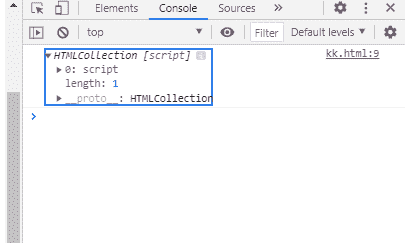
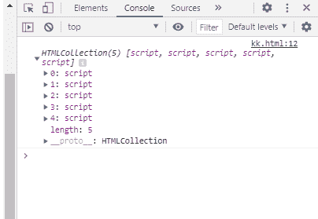

# SVG 文档脚本属性

> 原文:[https://www . geesforgeks . org/SVG-document-scripts-property/](https://www.geeksforgeeks.org/svg-document-scripts-property/)

SVG `<em>` Document.scripts 属性返回文档中脚本元素的列表。

**语法:**

```html
var scriptList = document.scripts

```

**返回值:**该属性返回文档中脚本元素的列表。

**例 1:**

## 超文本标记语言

```html
<!DOCTYPE html>
<html>

<body>
    <script></script>
    <svg width="700" height="500" 
        xmlns="http://www.w3.org/2000/svg">
        <script>
            console.log(document.scripts);
        </script>
    </svg>
</body>

</html>
```

**输出:**



**例 2:**

## 超文本标记语言

```html
<!DOCTYPE html>
<html>

<body>
    <script></script>
    <script></script>
    <script></script>
    <script></script>
    <script></script>
    <svg width="700" height="500" 
        xmlns="http://www.w3.org/2000/svg">
        <script>
            console.log(document.scripts);
        </script>
    </svg>
</body>

</html>
```

**输出:**

