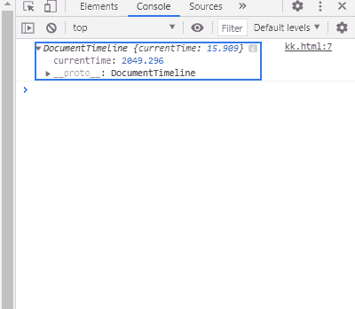
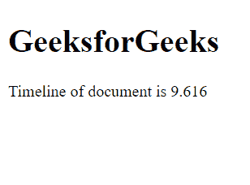

# SVG 文档.时间轴属性

> 原文:[https://www . geesforgeks . org/SVG-document-timeline-property/](https://www.geeksforgeeks.org/svg-document-timeline-property/)

**SVG Document.timeline 属性** 表示当前文档的默认时间线。该时间线是在页面加载时自动创建的。每个文档的时间线都是唯一的。

**语法:**

```html
var tl = document.timeline

```

**返回值:**该属性返回一个包含文档时间线信息的对象。

**例 1:**

## 超文本标记语言

```html
<!DOCTYPE html>
<html>

<body>
    <svg width="700" height="500" 
        xmlns="http://www.w3.org/2000/svg">

        <script>
            console.log(document.timeline);
        </script>
    </svg>
</body>

</html>
```

**输出:**



**例 2:**

## 超文本标记语言

```html
<!DOCTYPE html>
<html>

<body>
    <h1>GeeksforGeeks</h1>
    <div id="abc"></div>

    <svg width="700" height="500" 
        xmlns="http://www.w3.org/2000/svg">

        <script>
            var a = document.getElementById("abc");
            a.innerHTML = "Timeline of document is "
                + document.timeline.currentTime;
        </script>
    </svg>
</body>

</html>
```

**输出:**



**支持的浏览器:**

*   谷歌 Chrome
*   边缘
*   火狐浏览器
*   旅行队
*   歌剧
*   微软公司出品的 web 浏览器