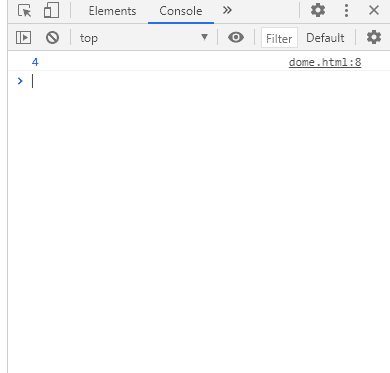
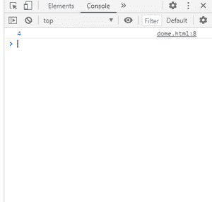

# SVG 多字符串长度属性

> 原文:[https://www . geesforgeks . org/SVG-DOM stringlist-length-property/](https://www.geeksforgeeks.org/svg-domstringlist-length-property/)

**SVG DOMStringList.length 属性** r 返回给定 DOMStringList 元素的长度。

**语法:**

```html
len= DOMStringList.Length
```

**返回值:**该属性返回DOM stringlist 的长度。

**例 1:**

## 超文本标记语言

```html
<!DOCTYPE html> 
<html> 

<body> 
    <svg width="350" height="350" 
        xmlns="http://www.w3.org/2000/svg">

        <script>
            var a=["gfg","a","c","eg"];
            console.log(a.length)
        </script>
    </svg>
</body> 

</html> 
```

**输出:**



**例 2:**

## 超文本标记语言

```html
<!DOCTYPE html> 
<html> 

<body> 
    <svg width="350" height="350" 
        xmlns="http://www.w3.org/2000/svg">

        <script>
            var a=[1,2,4,56];
            console.log(a.length)
        </script>
    </svg>
</body> 

</html>
```

**输出:**

