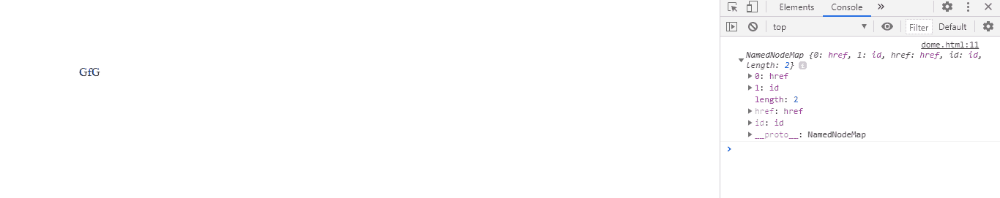
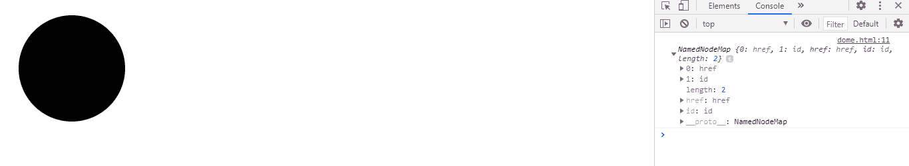

# SVG 元素.属性属性

> 原文:[https://www . geesforgeks . org/SVG-element-attributes-property/](https://www.geeksforgeeks.org/svg-element-attributes-property/)

属性 返回一个包含给定元素所有属性的对象。

**语法:**

```html
var attr = element.attributes
```

**返回值:**该属性返回一个包含元素所有属性的对象。

**例 1:**

## 超文本标记语言

```html
<!DOCTYPE html> 
<html> 

<body> 
    <svg width="350" height="350" 
        xmlns="http://www.w3.org/2000/svg">
        <a href="https://www.geeksforgeeks.org" id="gfg">
           <text x='100' y='100'>GfG</text>
        </a>
        <script>
           var g = document.getElementById('gfg');
           console.log(g.attributes)
        </script>
    </svg>
</body> 

</html>
```

**输出:**



**例 2:**

## 超文本标记语言

```html
<!DOCTYPE html> 
<html> 

<body> 
    <svg width="350" height="350" 
         xmlns="http://www.w3.org/2000/svg">
        <a href="https://www.geeksforgeeks.org" id="gfg">
            <circle cx='100' cy='100' r="80"></circle>
        </a>
        <script>
            var g = document.getElementById('gfg');
            console.log(g.attributes)
        </script>
    </svg>
</body> 

</html>
```

**输出:**

