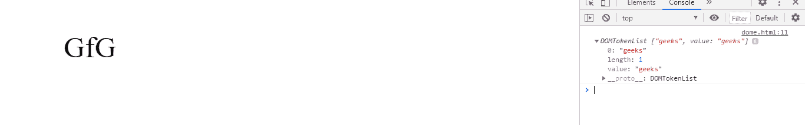
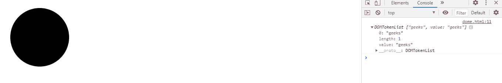

# SVG 元素类列表属性

> 原文:[https://www . geesforgeks . org/SVG-element-class list-property/](https://www.geeksforgeeks.org/svg-element-classlist-property/)

**SVG 元素类列表属性** 返回给定元素的类列表。

**语法:**

```html
var attr = element.classList
```

**返回值:**该属性返回元素的类列表。

**例 1:**

## 超文本标记语言

```html
<!DOCTYPE html>
<html>

<body>
    <svg width="350" height="350" 
        xmlns="http://www.w3.org/2000/svg">

        <a href="https://www.geeksforgeeks.org" 
            id="gfg" class="geeks">

            <text x='100' y='100' 
                font-size="50px">GfG
            </text>
        </a>

        <script>
            var g = document.getElementById('gfg');
            console.log(g.classList)
        </script>
    </svg>
</body>

</html>
```

**输出:**



**例 2:**

## 超文本标记语言

```html
<!DOCTYPE html>
<html>

<body>
    <svg width="350" height="350" 
        xmlns="http://www.w3.org/2000/svg">

        <a href="https://www.geeksforgeeks.org" 
            id="gfg" class="geeks">

            <circle cx='100' cy='100' r="80"></circle>
        </a>

        <script>
            var g = document.getElementById('gfg');
            console.log(g.classList)
        </script>
    </svg>
</body>

</html>
```

**输出:**

