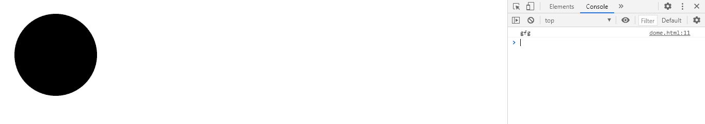
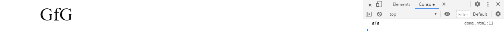

# SVG 元素标识属性

> 原文:[https://www.geeksforgeeks.org/svg-element-id-property/](https://www.geeksforgeeks.org/svg-element-id-property/)

属性 返回给定元素的标识。

**语法:**

```html
var idStr = element.id; // Get the id

```

**返回值:**该属性返回元素的 id 。

**例 1:**

## 超文本标记语言

```html
<!DOCTYPE html> 
<html> 

<body> 
    <svg width="350" height="350" 
        xmlns="http://www.w3.org/2000/svg">
        <a href="https://www.geeksforgeeks.org" id="gfg">
            <circle cx='100' cy='100' r="80"></circle>
        </a>
        <script>
            var g = document.getElementById('gfg');
            console.log(g.id)
        </script>
    </svg>
</body> 

</html>
```

**输出:**



**例 2:**

## 超文本标记语言

```html
<!DOCTYPE html> 
<html> 

<body> 
    <svg width="350" height="100" 
        xmlns="http://www.w3.org/2000/svg">
        <a href="https://www.geeksforgeeks.org" id="gfg">
            <text x='100' y='50' font-size="50px">GfG</text>
        </a>
        <script>
            var g = document.getElementById('gfg');
            console.log(g.id)
        </script>
    </svg>
</body> 

</html>
```

**输出:**

