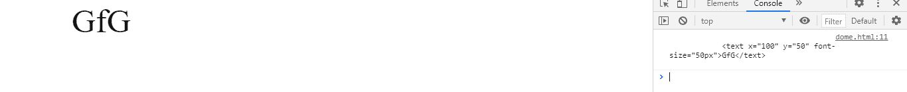
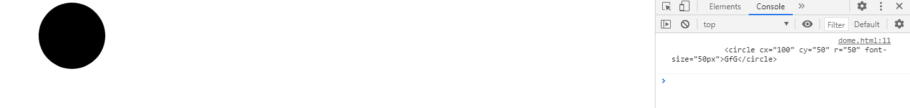

# SVG 元素内部 HTML 属性

> 原文:[https://www . geesforgeks . org/SVG-element-innerhtml-property/](https://www.geeksforgeeks.org/svg-element-innerhtml-property/)

**SVG Element.innerHTML 属性**返回给定元素的 innerHTML。

**语法:**

```html
const content = element.innerHTML
```

**返回值:**这个属性返回元素的 innerHTML。

**例 1:**

```html
<!DOCTYPE html>
<html>

<body>
    <svg width="350" height="100" 
        xmlns="http://www.w3.org/2000/svg">

        <a href="https://www.geeksforgeeks.org" id="gfg">

            <text x='100' y='50' font-size="50px">
                GfG
            </text>
        </a>

        <script>
            var g = document.getElementById('gfg');
            console.log(g.innerHTML);
        </script>
    </svg>
</body>

</html>
```

**输出:**



**例 2:**

```html
<!DOCTYPE html>
<html>

<body>
    <svg width="350" height="100" 
        xmlns="http://www.w3.org/2000/svg">

        <a href="https://www.geeksforgeeks.org" id="gfg">
            <circle cx='100' cy='50' r="50"> </circle>
        </a>

        <script>
            var g = document.getElementById('gfg');
            console.log(g.innerHTML);
        </script>
    </svg>
</body>

</html>
```

**输出:**

