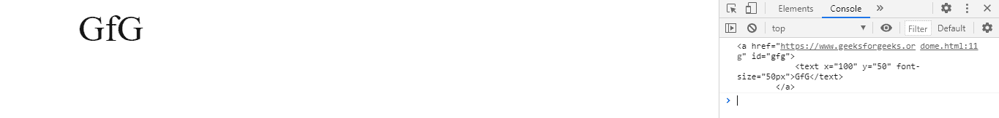
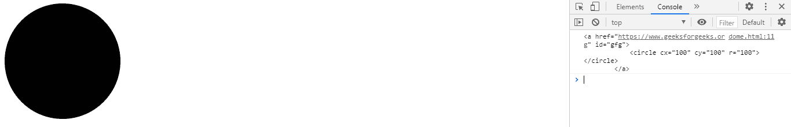

# SVG Element.outerHTML Property

> 原文：[https://www.geeksforgeeks.org/svg-element-outerhtml-property/](https://www.geeksforgeeks.org/svg-element-outerhtml-property/)

The **SVG Element.outerHTML property** returns innerHTML of the given element.

**Syntax:**

```html
const content = element.outerHTML
```

**Return value:** This property returns outerHTML spanof the element.

**Example 1: **

## HTML

```html
<!DOCTYPE html> 
<html> 

<body> 
    <svg width="350" height="100" 
        xmlns="http://www.w3.org/2000/svg">

        <a href="https://www.geeksforgeeks.org" id="gfg">
            <text x='100' y='50' font-size="50px">GfG</text>
        </a>

        <script>
            var g = document.getElementById('gfg');
            console.log(g.outerHTML);
        </script>
    </svg>
</body> 

</html>
```

**Output:**



**Example 2:** 

## HTML

```html
<!DOCTYPE html> 
<html> 

<body> 
    <svg width="350" height="500" 
        xmlns="http://www.w3.org/2000/svg">

        <a href="https://www.geeksforgeeks.org" id="gfg">
            <circle cx='100' cy='100'r="100"></circle>
        </a>

        <script>
            var g = document.getElementById('gfg');
            console.log(g.outerHTML);
        </script>
    </svg>
</body> 

</html>
```

**Output:**

