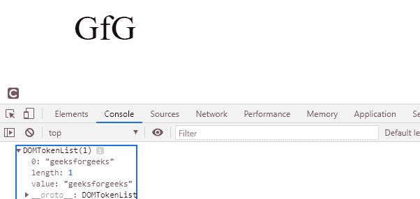
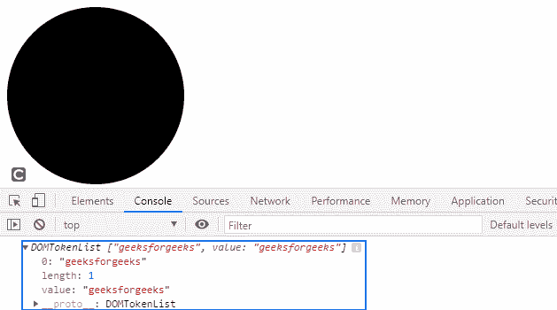

# SVG 元素零件属性

> 原文:[https://www.geeksforgeeks.org/svg-element-part-property/](https://www.geeksforgeeks.org/svg-element-part-property/)

SVG `<em>` Element.part 属性返回一个表示给定元素的零件标识符的 DOMTokenList。

**语法:**

```html
let elementPartList = element.part

```

**返回值:**该属性返回一个表示给定元素的部件标识符的 DOMTokenList。

**例 1:**

## 超文本标记语言

```html
<!DOCTYPE html>
<html>

<body>
    <svg width="350" height="100" 
        xmlns="http://www.w3.org/2000/svg">

        <a href="https://www.geeksforgeeks.org" id="gfg">
            <text x='100' y='50' font-size="50px">GfG</text>
        </a>

        <script>
            var g = document.getElementById('gfg');
            g.part = 'geeksforgeeks';
            console.log(g.part);
        </script>
    </svg>
</body>

</html>
```

**输出:**



**例 2:**

## 超文本标记语言

```html
<!DOCTYPE html>
<html>

<body>
    <svg width="350" height="500" 
        xmlns="http://www.w3.org/2000/svg">

        <a href="https://www.geeksforgeeks.org" id="gfg">
            <circle cx='100' cy='100' r="100"></circle>
        </a>

        <script>
            var g = document.getElementById('gfg');
            g.part = 'geeksforgeeks';
            console.log(g.part);
        </script>
    </svg>
</body>

</html>
```

**输出:**

