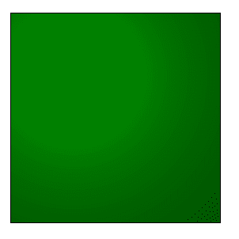
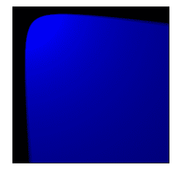

# SVG 元素

> 原文:[https://www.geeksforgeeks.org/svg-element/](https://www.geeksforgeeks.org/svg-element/)

SVG`<strong>`<fe 漫反射>滤镜使用 alpha 通道作为凹凸贴图来照亮图像。使用漫射照明时，面向光的物体侧面更亮，面向外的侧面更暗且有阴影。

**语法:**

```html
<feDiffuseLighting> Contents... </feDiffuseLighting>
```

**属性:**

*   **in—**in 属性标识给定过滤器原语的输入。
*   **表面刻度—** 表示表面的高度。它的值乘以 alpha 值。默认值为 1。
*   **扩散常数—** 为非负数，默认值为 1。
*   **内核长度** **—** 它表示内核矩阵中连续列和行之间的预期距离。预期距离以当前过滤器单位表示。默认值为 1。

**例 1:**

## 超文本标记语言

```html
<!DOCTYPE html>
<html>

<body>
    <svg viewBox="0 0 1000 1000">
        <filter id="lightMe2">
            <feDiffuseLighting in="SourceGraphic"
                surfaceScale="1" diffuseConstant="2" 
                kernelUnitLength="2">

                <fePointLight x="80" y="80" z="40" />

                <feDistantLight azimuth="240" 
                    elevation="20" />
            </feDiffuseLighting>

            <feComposite in="SourceGraphic" in2="light"
                operator="arithmetic" k1="1" k2="0" 
                k3="0" k4="0" />
        </filter>

        <rect x="20" y="20" width="200" height="200" 
            fill="green" 
            style="filter: url(#lightMe2);" />
    </svg>
</body>

</html>
```

**输出:**



**例 2:**

## 超文本标记语言

```html
<!DOCTYPE html>
<html>

<body>
    <svg viewBox="0 0 1000 1000">
        <filter id="lightMe3">
            <feDiffuseLighting in="BackgroundImage"
                surfaceScale="4" diffuseConstant="2"
                kernelUnitLength="2">

                <feSpotLight x="30" y="20" z="30" 
                    limitingConeAngle="40" 
                    pointsAtX="200" pointsAtY="200"
                    pointsAtZ="0" />

                <fePointLight x="80" y="80" z="40" />
            </feDiffuseLighting>

            <feComposite in="SourceGraphic" 
                in2="light" operator="arithmetic" 
                k1="1" k2="0" k3="0" k4="0" />
        </filter>

        <rect x="20" y="20" width="200" height="200" 
            fill="blue" 
            style="filter: url(#lightMe3);" />
    </svg>
</body>

</html>
```

**输出:**

