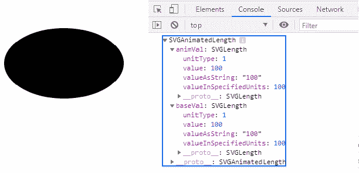
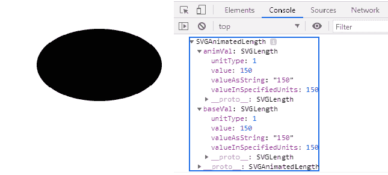

# SVG ellipselement . CX 属性

> 原文:[https://www . geesforgeks . org/SVG-ellipselement-CX-property/](https://www.geeksforgeeks.org/svg-ellipseelement-cx-property/)

属性返回一个与给定椭圆元素的属性相对应的**对象**

**语法:**

```html
EllipseElement.cx

```

**返回值:**该属性返回一个可用于获取椭圆元素 cx 的 SVGAnimatedLength 对象

**例 1:**

## 超文本标记语言

```html
<!DOCTYPE html>
<html>

<body>
    <svg width="200" height="200" 
        xmlns="http://www.w3.org/2000/svg">

        <ellipse cx="100" cy="100" rx="100" 
            ry="60" id="ellipse" 
            onclick="outputSize();" />

        <script>
            var g = document.getElementById("ellipse");
            console.log(g.cx)
        </script>
    </svg>
</body>

</html>
```

**输出:**



**例 2:**

## 超文本标记语言

```html
<!DOCTYPE html>
<html>

<body>
    <svg width="300" height="200" 
        xmlns="http://www.w3.org/2000/svg">

        <ellipse cx="150" cy="100" rx="100" 
            ry="60" id="ellipse" 
            onclick="outputSize();" />

        <script>
            var g = document.getElementById("ellipse");
            console.log(g.cx)
        </script>
    </svg>
</body>

</html>
```

**输出:**

