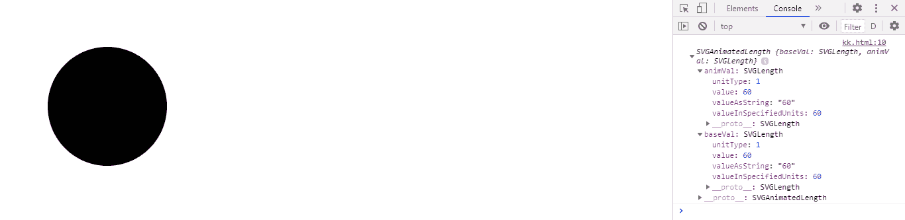
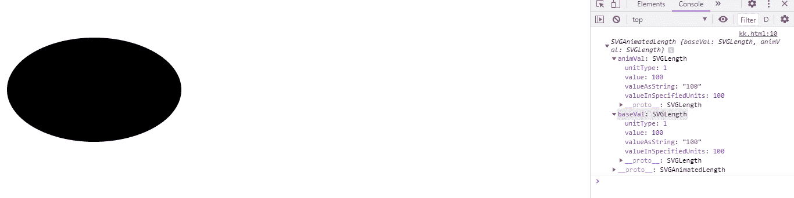

# SVG 椭球体. rx 性质

> 原文:[https://www . geesforgeks . org/SVG-ellipselement-rx-property/](https://www.geeksforgeeks.org/svg-ellipseelement-rx-property/)

属性返回一个对应于给定椭圆元素属性的对象

**语法:**

```html
EllipseElement.rx
```

**返回值:**这个属性返回一个 SVGAnimatedLength 对象，可以用来获取椭圆元素的 rx

**例 1:**

```html
<!DOCTYPE html>
<html>

<body>
    <svg width="300" height="300" xmlns="http://www.w3.org/2000/svg">
  <ellipse cx="100" cy="100" rx="60" ry="60" id="ellipse"
      onclick="outputSize();"/>
          <script>
              var g = document.getElementById("ellipse");
              console.log(g.rx)
          </script>
    </svg>
</body>

</html>
```

**输出:**



**例 2:**

```html
<!DOCTYPE html>
<html>

<body>
    <svg width="300" height="300" xmlns="http://www.w3.org/2000/svg">
  <ellipse cx="100" cy="100" rx="100" ry="60" id="ellipse"
      onclick="outputSize();"/>
          <script>
              var g = document.getElementById("ellipse");
              console.log(g.rx)
          </script>
    </svg>
</body>

</html>
```

**输出:**

