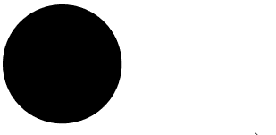
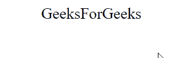
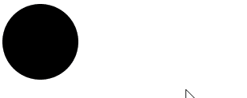
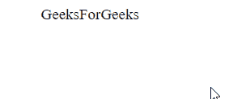

# SVG 事件可取消属性

> 原文:[https://www . geesforgeks . org/SVG-event-cancelable-property/](https://www.geeksforgeeks.org/svg-event-cancelable-property/)

SVG `<em>` Event.cancelable 属性表示事件是否可以取消。

**语法:**

```html
bool = event.cancelable
```

**返回值:**该属性返回事件元素的布尔值。

**示例 1:** 在下面的示例中，我们将使用 *onclick* 事件。

## 超文本标记语言

```html
<!DOCTYPE html>
<html>

<body>
    <svg viewBox="0 0 1000 1000" 
        xmlns="http://www.w3.org/2000/svg">

        <circle cx="50" cy="50" r="50" 
            onclick="check(event)" />

        <script type="text/javascript">
            function check(event) {
                document.write(
                    "This Event is cancelable : ",
                    event.cancelable);
            }
        </script>
    </svg>
</body>

</html>
```

**输出:**



**示例 2:** 在下面的示例中，我们使用的是 *onclick* 事件。

## 超文本标记语言

```html
<!DOCTYPE html>
<html>

<body>
    <svg viewBox="0 0 1000 1000" 
        xmlns="http://www.w3.org/2000/svg">

        <text x="50" y="20" font-size="20px" 
            onclick="check(event)">
            GeeksForGeeks
        </text>

        <script type="text/javascript">
            function check(event) {
                document.write(
                    "This Event is cancelable : ",
                    event.cancelable);
            }
        </script>
    </svg>
</body>

</html>
```

**输出:**



**示例 3:** 在下面的示例中，我们使用的是 *onmouseover* 事件。

## 超文本标记语言

```html
<!DOCTYPE html>
<html>

<body>
    <svg viewBox="0 0 1000 1000"
        xmlns="http://www.w3.org/2000/svg">

        <circle cx="50" cy="50" r="50" 
            onmouseover="check(event)" />

        <script type="text/javascript">
            function check(event) {
                document.write(
                    "This Event is cancelable : ", 
                    event.cancelable);
            }
        </script>
    </svg>
</body>

</html>
```

**输出:**



**例 4:** 在本例中，我们将使用 *onmouseover* 事件。

## 超文本标记语言

```html
<!DOCTYPE html>
<html>

<body>
    <svg viewBox="0 0 1000 1000" 
        xmlns="http://www.w3.org/2000/svg">

        <text x="50" y="20" font-size="20px"
            onmouseover="check(event)">
            GeeksForGeeks
        </text>

        <script type="text/javascript">
            function check(event) {
                document.write(
                    "This Event is cancelable : ",
                    event.cancelable);
            }
        </script>
    </svg>
</body>

</html>
```

**输出:**

