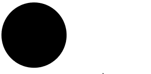
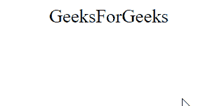
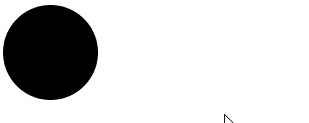
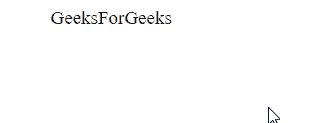

# SVG 事件合成属性

> 原文:[https://www.geeksforgeeks.org/svg-event-composed-property/](https://www.geeksforgeeks.org/svg-event-composed-property/)

**SVG 事件合成属性**指示事件是否将通过阴影 DOM 边界传播到标准 DOM 中。

**语法:**

```html
const isComposed = Event.composed
```

**返回值:**该属性返回事件元素的布尔值。

**示例 1:** 在本例中，我们将使用 onclick 事件。

```html
<!DOCTYPE html>
<html>

<body>
    <svg viewBox="0 0 1000 1000" 
        xmlns="http://www.w3.org/2000/svg">

        <circle cx="50" cy="50" r="50" 
            onclick="check(event)" />

        <script type="text/javascript">
            function check(event) {
                document.write(
                    "This Event is composed : ",
                    event.composed);
            }
        </script>
    </svg>
</body>

</html>
```

**输出:**



**示例 2:** 在本例中，我们将使用 onclick 事件。

```html
<!DOCTYPE html>
<html>

<body>
    <svg viewBox="0 0 1000 1000" 
        xmlns="http://www.w3.org/2000/svg">

        <text x="50" y="20" font-size="20px" 
            onclick="check(event)">
            GeeksForGeeks
        </text>

        <script type="text/javascript">
            function check(event) {
                document.write(
                    "This Event is composed : ",
                    event.composed);
            }
        </script>
    </svg>
</body>

</html>
```

**输出:**



**示例 3:** 在本例中，我们将使用 onmouseover 事件。

```html
<!DOCTYPE html>
<html>

<body>
    <svg viewBox="0 0 1000 1000" 
        xmlns="http://www.w3.org/2000/svg">

        <circle cx="50" cy="50" r="50" 
            onmouseover="check(event)" />

        <script type="text/javascript">
            function check(event) {
                document.write(
                    "This Event is composed : ",
                    event.composed);
            }
        </script>
    </svg>
</body>

</html>
```

**输出:**



**示例 4:** 在本例中，我们将使用 onmouseover 事件。

```html
<!DOCTYPE html>
<html>

<body>
    <svg viewBox="0 0 1000 1000" 
        xmlns="http://www.w3.org/2000/svg">

        <text x="50" y="20" font-size="20px" 
            onmouseover="check(event)">
            GeeksForGeeks
        </text>

        <script type="text/javascript">
            function check(event) {
                document.write(
                    "This Event is composed : ",
                    event.composed);
            }
        </script>
    </svg>
</body>

</html>
```

**输出:**

