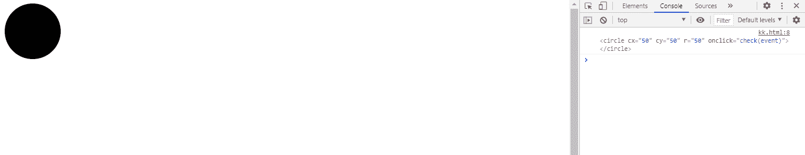
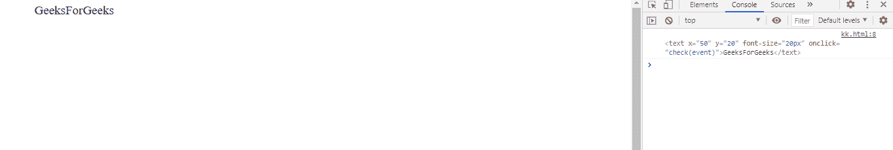

# SVG 事件.电流目标属性

> 原文:[https://www . geesforgeks . org/SVG-event-current target-property/](https://www.geeksforgeeks.org/svg-event-currenttarget-property/)

当事件遍历 DOM 时， **SVG Event.currentTarget 属性**标识事件的当前目标。

**语法:**

```html
var currentEventTarget = event.currentTarget
```

**返回值:**该属性返回事件元素的对象值。

**例 1:**

```html
<!DOCTYPE html>
<html>

<body>
    <svg viewBox="0 0 1000 1000" 
        xmlns="http://www.w3.org/2000/svg">

        <circle cx="50" cy="50" r="50" 
            onclick="check(event)" />

        <script type="text/javascript">
            function check(event) {
                console.log(event.currentTarget);
            }
        </script>
    </svg>
</body>

</html>
```

**输出:**



**例 2:**

```html
<!DOCTYPE html>
<html>

<body>
    <svg viewBox="0 0 1000 1000" 
        xmlns="http://www.w3.org/2000/svg">

        <text x="50" y="20" font-size="20px" 
            onclick="check(event)">
            GeeksForGeeks
        </text>

        <script type="text/javascript">
            function check(event) {
                console.log(event.currentTarget);
            }
        </script>
    </svg>
</body>

</html>
```

**输出:**

