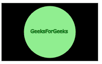

# SVG `<feBlend>`元素

> 原文： [https://www.geeksforgeeks.org/svg-feblend-element/](https://www.geeksforgeeks.org/svg-feblend-element/)

SVG 代表可缩放矢量图形。它可以用来制作像在 HTML 画布中的图形和动画。

**< feBlend >** 元素用于将两幅图像或 SVG 片段组合成单个图形。它执行两个输入 SVG 片段或图像的像素组合。

**语法:**

```html
 <feBlend in="" in2="" mode=""/>
```

**属性:**

*   中的**–它标识给定过滤器原语的输入。**
*   **in2**–它识别给定过滤器原语的第二个输入。它采用与“in”属性相同的值。
*   **模式**–它定义了< feBlend >滤镜图元上的混合模式。如果未指定**模式**，则执行**正常**值。

**例 1:**

```html
<!DOCTYPE html>
<html>

<body>
    <svg width="200" height="200">
        <defs>
            <filter id="spotlight">
                <feFlood result="floodFill" 
                    x="0" y="0" width="100%" 
                    height="100%" flood-color="green"
                    flood-opacity="1" />

                <feBlend in="FillPaint" 
                    in2="floodFill" mode="multiply" />
            </filter>
        </defs>

        <rect x="40" y="40" width="100" 
            height="100" style="stroke: #000000; 
                         fill: lightgreen; 
                         filter: url(#spotlight);" />

        <rect x="40" y="40" width="100" height="100" 
            style="stroke: #000000; fill: green;" />

        <g fill="#FFFFFF" stroke="black" font-size="10" 
            font-family="Verdana">

            <text x="50" y="90">GeeksForGeeks</text>
        </g>
    </svg>
</body>

</html>
```

**输出:**


**例 2:**

```html
<!DOCTYPE html>
<html>

<body>
    <svg width="200" height="200">
        <defs>
            <filter id="Screen">
                <feBlend mode="screen" 
                    in2="BackgroundImage" 
                    in="SourceGraphic" />
            </filter>
        </defs>

        <rect x="1" y="1" width="198" 
            height="118" style="stroke: #000000;
                                fill: black;
                                filter: url(#Screen);" />

        <circle cx="100" cy="60" r="55" 
            stroke="black" stroke-width="3" 
            fill="Lightgreen" />

        <g fill="#FFFFFF" stroke="Green" 
            font-size="10" c font-family="Verdana">

            <text x="60" y="62">GeeksForGeeks</text>
        </g>
    </svg>
</body>

</html>
```

**输出:**

