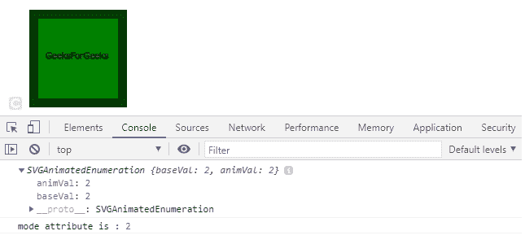

# SVG FEBlendElement.mode 属性

> 原文:[https://www . geeksforgeeks . org/SVG-feblendelement-mode-property/](https://www.geeksforgeeks.org/svg-feblendelement-mode-property/)

**SVG FEBlendElement.mode** 属性返回对应于 *FEBlendElement.mode* 元素的*模式*属性的**SVorganimatedenumeration**对象。

**语法:**

```html
var a = FEBlendElement.mode
```

**返回值:**该属性返回与 *FEBlendElement.mode* 元素的*模式*属性对应的**svorganimatedenumeration**对象。

**例 1:**

## 超文本标记语言

```html
<!DOCTYPE html>
<html>

<body>
    <svg width="200" height="200">
        <defs>
            <filter id="spotlight">
                <feFlood result="floodFill" 
                    x="0" y="0" width="100%" 
                    height="100%" 
                    flood-color="green"
                    flood-opacity="1" />

                <feBlend in="FillPaint" 
                    in2="floodFill" 
                    mode="multiply" 
                    id="gfg" />
            </filter>
        </defs>

        <rect x="40" y="40" width="100" 
            height="100" 
            style="stroke: #000000; 
                fill: lightgreen; 
                filter: url(#spotlight);" />

        <rect x="40" y="40" width="100" 
            height="100" 
            style="stroke: #000000; 
                fill: green;" />

        <g fill="#FFFFFF" stroke="black" 
            font-size="10" 
            font-family="Verdana">

            <text x="50" y="90">
                GeeksForGeeks
            </text>
        </g>
    </svg>

    <script type="text/javascript">
        var g = document.getElementById("gfg");
        console.log(g.mode);

        console.log("mode attribute is :", 
                g.mode.baseVal)
    </script>
</body>

</html>
```

**输出:**



**例 2:**

## 超文本标记语言

```html
<!DOCTYPE html>
<html>

<body>
    <svg width="200" height="200">
        <defs>
            <filter id="Screen">
                <feBlend mode="screen" 
                    in2="BackgroundImage" 
                    in="SourceGraphic" 
                    id="gfg" />
            </filter>
        </defs>

        <rect x="1" y="1" width="198" 
            height="118" 
            style="stroke: #000000; 
                fill: black; 
                filter: url(#Screen);" />

        <circle cx="100" cy="60" r="55" 
            stroke="black" 
            stroke-width="3" 
            fill="Lightgreen" />

        <g fill="#FFFFFF" stroke="Green" 
            font-size="10" 
            c font-family="Verdana">

            <text x="60" y="62">
                GeeksForGeeks
            </text>

            <script type="text/javascript">
                var g = document.getElementById("gfg");
                console.log(g.mode);

                console.log("mode attribute is :", 
                        g.mode.baseVal)
            </script>
        </g>
    </svg>
</body>

</html> 
```

**输出:**


**支持的浏览器:**

*   谷歌 Chrome
*   边缘
*   火狐浏览器
*   旅行队
*   歌剧
*   微软公司出品的 web 浏览器