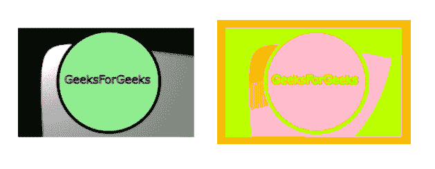
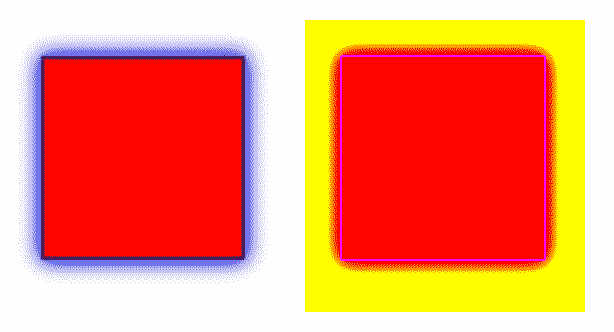

# SVG `<feComponentTransfer>`元素

> 原文:[https://www . geeksforgeeks . org/SVG-feccomponent transfer-element/](https://www.geeksforgeeks.org/svg-fecomponenttransfer-element/)

*   SVG 代表可缩放矢量图形。它可以用来制作像在 HTML 画布中的图形和动画。
*   **<元素分别在每个颜色通道上实现颜色操作。**
*   这个元素的四个颜色通道分别是<fefuncr>、<fefuncg>、<fefuncb>和<fefunca>。</fefunca></fefuncb></fefuncg></fefuncr>
*   在执行颜色操作时，元素应该每种类型只有一个子元素。

**语法:**

```html
<feComponentTransfer in="">
----
</feComponentTransfer>

```

**属性:**

*   **in–**它存储给定图元的输入。**T3】**

**例 1:**

## 超文本标记语言

```html
<html> 
<title>SVG Filter</title> 
<body> 

<svg width="640" height="550" viewBox="0 0 640 550">
<defs>
    <filter id="new" filterUnits="objectBoundingBox" x="0%" y="0%" width="100%" height="100%">

      <feComponentTransfer>
        <feFuncA type="table" tableValues="0 0 1 1"/>
        <feFuncB type="table" tableValues="0 1 0 1"/>
        <feFuncG type="table" tableValues="1 1 0 0"/>
        <feFuncR type="table" tableValues="0 0 1 0"/>
    </feComponentTransfer>

    </filter>
  </defs>

  <image x="10" y="10" width="280" height="350" preserveAspectRatio="true" 
                       xlink:href="C:/Users/pc/Desktop/gfg/Capture25.png"/>
  <image x="310" y="10" width="280" height="350" preserveAspectRatio="true" 
         filter="url(#new)" xlink:href="C:/Users/pc/Desktop/gfg/Capture25.png"/>
</svg>

</body> 
</html>
```

**输出:**


**例 2:**

## 超文本标记语言

```html
<html> 
<title>SVG Filter</title> 
<body> 

<svg width="640" height="550" viewBox="0 0 640 550">
<defs>
    <filter id="new" filterUnits="objectBoundingBox" x="0%" y="0%" width="100%" height="100%">

          <feComponentTransfer in="BackgroundImage" result="A">
        <feFuncA type="discrete" tableValues="0 0 1 1"/>
        <feFuncB type="discrete" tableValues="0.0 0.6 0.1 0.0"/>
        <feFuncG type="discrete" tableValues="1 0.5 0.5 0.5"/>
        <feFuncR type="discrete" tableValues="0.5 1 1 1.0"/>

      </feComponentTransfer>

    </filter>
  </defs>

  <image x="10" y="10" width="280" height="350" preserveAspectRatio="true" 
                       xlink:href="C:/Users/pc/Desktop/gfg/Capture82.png"/>
  <image x="310" y="10" width="280" height="350" preserveAspectRatio="true" filter="url(#new)" 
  xlink:href="C:/Users/pc/Desktop/gfg/Capture82.png"/>
</svg>

</body> 
</html>
```

**输出:**



**例 3 :**

## 超文本标记语言

```html
<html> 
<title>SVG Filter</title> 
<body> 

<svg width="640" height="550" viewBox="0 0 640 550">
<defs>
    <filter id="new" filterUnits="objectBoundingBox" x="0%" y="0%" width="100%" height="100%">

          <feComponentTransfer in="BackgroundImage" result="A">
        <feFuncA type="table" tableValues="0 0 1 1"/>
        <feFuncB type="discrete" tableValues="0 1 1 0"></feFuncB>
        <feFuncG type="gamma" amplitude="3" exponent="3" offset="0"></feFuncG>
        <feFuncR type="linear" slope="1.5" intercept="2"></feFuncR>

      </feComponentTransfer>

    </filter>
  </defs>

  <image x="10" y="10" width="280" height="350" preserveAspectRatio="true" 
                       xlink:href="C:/Users/pc/Desktop/gfg/Capture26.png"/>
  <image x="310" y="10" width="280" height="350" preserveAspectRatio="true" filter="url(#new)" 
  xlink:href="C:/Users/pc/Desktop/gfg/Capture26.png"/>
</svg>

</body> 
</html>
```

**输出:**

