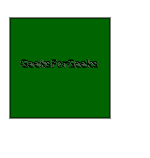
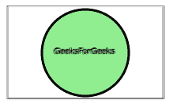

# SVG `<feConvolveMatrix>`元素

> 哎哎哎:# t0]https://www . geeksforgeeks . org/SVG-feconvolution matrix 元素/

SVG 代表可缩放矢量图形。它可以用来制作像在 HTML 画布中的图形和动画。

**<feconvolvelmatrix>**SVG 滤镜原语会将输入图像中的像素与相邻像素进行更改，以生成结果图像。

**语法:**

```html
<feConvolveMatrix in="" order="" kernelMatrix="" divisor="" 
    bias="" targetX="" targetY="" edgeMode="" kernelUnitLength=""
    preserveAlpha="" />

```

**属性:**

*   中的**–存储给定图元的输入。**
*   **订购**–测试滤芯使用的基质大小。默认情况下是 3 X 3。
*   **内核矩阵**–它定义了构成内核矩阵的数字列表。
*   **除数**–定义核矩阵的值之和。默认设置为 **1** 。
*   **偏置**–设置过滤器的范围。默认情况下，它设置为 0。
*   **targetX**–水平移动卷积矩阵。(**范围**–0<= TargetX<订单 x)。
*   **目标**–垂直移动卷积矩阵。(**范围**–0<=目标<顺序)。
*   **内核长度**–它表示内核矩阵中连续列和行之间的预期距离。预期距离以当前过滤器单位表示。默认值为 **1。**
*   **保留值**–该值为真或假。它指示卷积是否仅适用于 alpha 和颜色通道。默认值为假。

**例 1:**

```html
<!DOCTYPE html>
<html>

<body>
    <svg width="100%" height="220">
        <defs>
            <filter id="convolve">
                <feConvolveMatrix kernelMatrix=
                    "1 5 -1 -1 0 4 0 0 -1" />
            </filter>
        </defs>

        <rect x="40" y="40" width="100" 
            height="100" 
            filter: url(#convolve) style=
                "stroke: #000000;
                fill: darkgreen;" />

        <g fill="#FFFFFF" stroke="black" 
            font-size="10" font-family="Verdana">

            <text x="50" y="90" 
                filter="url(#convolve)">
                GeeksForGeeks
            </text>
        </g>
    </svg>
</body>

</html>
```

**输出:**



**例 2:**

```html
<!DOCTYPE html>
<html>
<title>SVG Filter</title>

<body>
    <svg width="100%" height="220">
        <defs>
            <filter id="convolve">
                <feConvolveMatrix kernelMatrix
                ="-7 -10 -15 -10 10 -1 0 0 -1" />
            </filter>
        </defs>

        <rect x="1" y="1" width="198" 
            height="118" 
            style="stroke: #000000; 
                    fill: none;
                    filter: url(#convolve);" />

        <circle cx="100" cy="60" r="55" 
            stroke="black" stroke-width="3" 
            fill="Lightgreen" 
            filter: url(#convolve) />

        <g fill="#FFFFFF" stroke="black" 
            font-size="10" font-family="Verdana">
            <text x="60" y="62" filter="url(#convolve)">
                GeeksForGeeks</text>
        </g>
    </svg>
</body>

</html>
```

**输出:**

