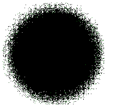
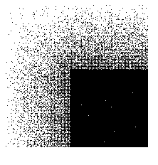

# SVG `<feDisplacementMap>`元素

> 原文:[https://www . geeksforgeeks . org/SVG-fe 置换 mentmap-element/](https://www.geeksforgeeks.org/svg-fedisplacementmap-element/)

SVG 代表可缩放矢量图形。它可以用来制作像在 HTML 画布中的图形和动画。

使用**<Fe 置换贴图>** SVG 过滤器图元来使用置换贴图在空间上置换图像内容。产生一个结果需要两个输入。要替换的图像内容在**“in2”**属性中指定。应用位移效果的内容保留在“属性中的**。**

**语法:**

```html
<feDisplacementMap in2="" in="" scale="" 
    xChannelSelector="" yChannelSelector=""/>

```

**属性:**

*   中的**–它标识给定过滤器原语的输入。**
*   **in2**–它识别给定过滤器原语的第二个输入。它的工作原理与 in 属性完全一样。
*   **比例**–它定义了要在<位移贴图>过滤器图元上使用的位移比例因子。
*   **xChannelSelector**-它指示从 in2 到哪个颜色通道用于沿 x 轴移动“in”中的像素。
*   **yChannelSelector**–它指示从 in2 到哪个颜色通道用于沿 y 轴移动“in”中的像素。

**例 1:**

```html
<!DOCTYPE html>
<html>

<body>
    <svg width="200" height="200" 
        viewBox="0 0 220 220">

        <filter id="displacementFilter">

            <feTurbulence type="turbulence" 
                baseFrequency="1" 
                numOctaves="2" 
                result="turbulence" />

            <feDisplacementMap in2="turbulence" 
                in="SourceGraphic" scale="50" 
                xChannelSelector="R"
                yChannelSelector="B" />
        </filter>

        <circle cx="100" cy="100" r="100" 
            stroke="green" style=
            "filter: url(#displacementFilter)" />
    </svg>
</body>

</html>
```

**输出:**



**例 2:**

```html
<!DOCTYPE html>
<html>

<body>
    <svg width="200" height="200" 
        viewBox="0 0 220 220">

        <filter id="displacementFilter">

            <feTurbulence type="turbulence" 
                baseFrequency="5" numOctaves="2" 
                result="turbulence" />

            <feDisplacementMap in2="abc" 
                in="SourceGraphic" scale="200" 
                xChannelSelector="B" 
                yChannelSelector="R" />
        </filter>

        <rect width="250" height="250" style
        ="filter: url(#displacementFilter)" />
    </svg>
</body>

</html>
```

**输出:**

