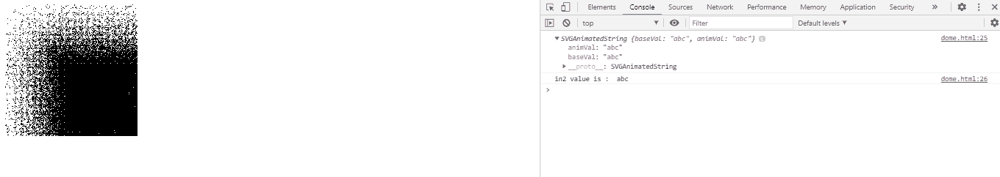
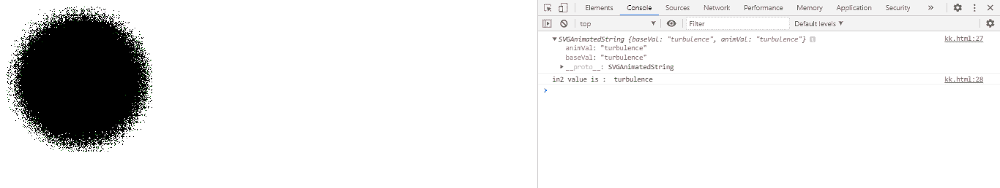

# SVGFe 置换图. in2 属性

> 原文:[https://www . geeksforgeeks . org/SVG-fe 置换 mentmap-in2-property/](https://www.geeksforgeeks.org/svg-fedisplacementmap-in2-property/)

**SVGFe 置换映射. in2 属性**返回对应于 Fe 置换映射元素的 *in2* 组件的 SVGAnimatedString 对象。

**语法:**

```html
let in_prop = FEDisplacementMap.in2
```

**返回值:**该属性返回对应于 fe 置换映射元素 in2 成分的 SVGAnimatedString 对象。

**例 1:**

## 超文本标记语言

```html
<!DOCTYPE html>
<html>
<body>
  <svg width="200" height="200"
       viewBox="0 0 220 220">

    <filter id="displacementFilter">

      <feTurbulence type="turbulence"
        baseFrequency="5" 
        numOctaves="2" 
        result="turbulence" />

      <feDisplacementMap in2="abc" 
        in="SourceGraphic" 
        scale="200" xChannelSelector="B"
        yChannelSelector="R" id="gfg" />
    </filter>

    <rect width="250" height="250" style=
          "filter: url(#displacementFilter)" />

    <script type="text/javascript">
      var g = document.getElementById("gfg");
      console.log(g.in2)
      console.log("in2 value is : ",
                  g.in2.baseVal)
    </script>
  </svg>
</body>
</html>
```

**输出:**



**例 2:**

## 超文本标记语言

```html
<!DOCTYPE html>
<html>
<body>
  <svg width="200" height="200"
       viewBox="0 0 220 220">

    <filter id="displacementFilter">

      <feTurbulence type="turbulence"
        baseFrequency="1"
        numOctaves="2" 
        result="turbulence" />

      <feDisplacementMap in2="turbulence"
        in="SourceGraphic"
        scale="50" 
        xChannelSelector="R" 
        yChannelSelector="B"
        id="gfg" />
    </filter>

    <circle cx="100" cy="100" r="100"
            stroke="green" style=
            "filter: url(#displacementFilter)" />

    <script type="text/javascript">
      var g = document.getElementById("gfg");
      console.log(g.in2);
      console.log("in2 value is : ",
                  g.in2.baseVal)
    </script>
  </svg>
</body>
</html>
```

**输出:**



**支持的浏览器:**

*   谷歌 Chrome
*   边缘
*   火狐浏览器
*   旅行队
*   歌剧
*   微软公司出品的 web 浏览器