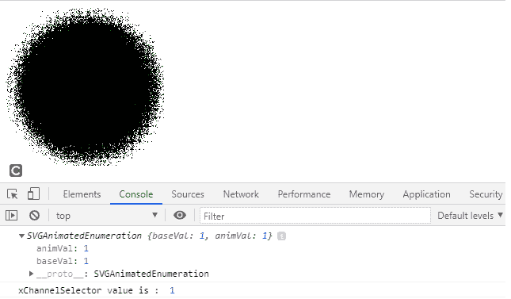
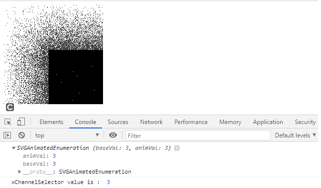

# SVGFe 置换地图. XchannelSelect 属性

> 原文:[https://www . geeksforgeeks . org/SVG-fe 置换 mentmap-xchannelselect-property/](https://www.geeksforgeeks.org/svg-fedisplacementmap-xchannelselector-property/)

SVG`<em>`fe 置换映射. xChannelSelector 属性返回对应于*fe 置换映射. xChannelSelector* 元素的 *xChannelSelector* 组件的**svorganimatedenumeration**对象。

**语法:**

```html
var a = FEDisplacementMap.xChannelSelector
```

**返回值:**该属性返回与*元素的 *xChannelSelector* 组件对应的**svorganimatedenumeration**对象。*

**例 1:**

## 超文本标记语言

```html
<!DOCTYPE html> 
<html> 

<body> 
    <svg width="200" height="200"
        viewBox="0 0 220 220"> 

        <filter id="displacementFilter"> 

            <feTurbulence type="turbulence"
                baseFrequency="1" numOctaves="2"
                result="turbulence"/> 

            <feDisplacementMap in2="turbulence"
                in="SourceGraphic" scale="50"
                xChannelSelector="R"
                yChannelSelector="B"  id="gfg"/> 
        </filter> 

        <circle cx="100" cy="100" r="100"
            stroke="green" style= 
            "filter: url(#displacementFilter)" /> 

        <script type="text/javascript">
            var g = document.getElementById("gfg");
            console.log(g.xChannelSelector)
            console.log("xChannelSelector value is : ", 
            g.xChannelSelector.baseVal)

        </script>
    </svg> 
</body> 

</html> 
```

**输出:**



**例 2:**

## 超文本标记语言

```html
<!DOCTYPE html> 
<html> 

<body> 
    <svg width="200" height="200"
        viewBox="0 0 220 220"> 

        <filter id="displacementFilter"> 

            <feTurbulence type="turbulence"
                baseFrequency="5" numOctaves="2"
                result="turbulence" /> 

            <feDisplacementMap in2="abc"
                in="SourceGraphic" scale="200"
                xChannelSelector="B"
                yChannelSelector="R" id="gfg" /> 
        </filter> 

        <rect width="250" height="250" style
        ="filter: url(#displacementFilter)" /> 

        <script type="text/javascript">
            var g = document.getElementById("gfg");
            console.log(g.xChannelSelector)
            console.log("xChannelSelector value is : ", 
            g.xChannelSelector.baseVal)
        </script>
    </svg> 
</body> 

</html> 
```

**输出:**



**支持的浏览器:**

*   谷歌 Chrome
*   边缘
*   火狐浏览器
*   旅行队
*   歌剧
*   微软公司出品的 web 浏览器