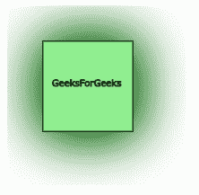
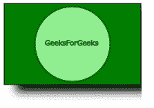

# SVG `<feDropShadow>`元素

> 原文:[https://www.geeksforgeeks.org/svg-fedropshadow-element/](https://www.geeksforgeeks.org/svg-fedropshadow-element/)

SVG 代表可缩放矢量图形。它可以用来制作像在 HTML 画布中的图形和动画。
**<FeDropShadow>**元素与其他滤镜图元结合使用，为图形添加一个阴影。它在原始输入后面提供了一个模糊的、彩色的和可选的偏移层。

**语法:**

```html
<feDropShadow in="" dx="" dy="" stdDeviation=""/>

```

**属性:**

*   中的**标识给定过滤器原语的输入。**
*   **dx，** **dy:** 它定义了元素在其各自的 x、y 轴上的位置偏移。
*   **标准偏差:**定义应用于投影的模糊量。默认值为 **0。**

**例 1:**

## 超文本标记语言

```html
<!DOCTYPE html>
<html>

<body>
    <svg width="200" height="200">

        <defs>
            <filter id="drop_shadow" 
                filterUnits="objectBoundingBox" 
                x="-50%" y="-60%" width="250%" 
                height="250%">

                <feDropShadow in="SourceGraphic" 
                    dx="1" dy="1" stdDeviation="30" 
                    flood-color="darkgreen" />
            </filter>
        </defs>

        <rect x="40" y="40" width="100" height="100"
            style="stroke: #000000; 
                fill: lightgreen; 
                filter: url(#drop_shadow);" />

        <rect x="40" y="40" width="100" height="100"
            style="stroke: #000000; 
                fill: lightgreen; 
                filter: url(#drop_shadow);" />

        <g fill="#FFFFFF" stroke="black" 
            font-size="10" font-family="Verdana">
            <text x="50" y="90">GeeksForGeeks</text>
    </svg>
</body>

</html>
```

**输出:**



**例 2:**

## 超文本标记语言

```html
<!DOCTYPE html>
<html>

<body>
    <svg width="200" height="200">
        <defs>
            <filter id="blur" 
                filterUnits="objectBoundingBox" 
                x="-10%" y="-10%" width="300%" 
                height="300%">

                <feDropShadow dx="18" dy="10" 
                    stdDeviation="6" 
                    flood-color="shadow" 
                    flood-opacity="2" />
            </filter>
        </defs>

        <rect x="1" y="1" width="198" 
            height="118" style="stroke: #000000; 
                fill: green; filter: url(#blur);" />

        <circle cx="100" cy="60" r="55" 
            stroke="darkgreen" stroke-width="3" 
            fill="Lightgreen"
            style="stroke: filter: url(#blur);" />

        <g fill="#FFFFFF" stroke="Green" 
            font-size="10" c font-family="Verdana">
            <text x="60" y="62">GeeksForGeeks</text>
    </svg>
</body>

</html>
```

**输出:**

