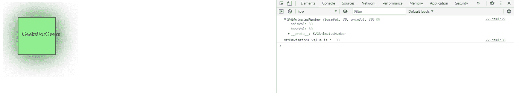
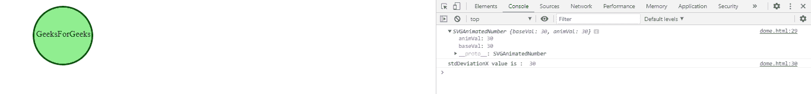

# SVG FeDropShadow . stddeviation x 属性

> 原文:[https://www . geesforgeks . org/SVG-fed opshadow-stddeviation x-property/](https://www.geeksforgeeks.org/svg-fedropshadow-stddeviationx-property/)

**SVG FedropShadow . stdDeviationX 属性**返回对应于 Fe 置换映射. stdDeviationX 元素的 stddeviation x 组件的 SVGAnimatedNumber 对象。

**语法:**

```html
var a = FEDropShadow.stdDeviationX
```

**返回值:**此属性返回对应于 fe 置换映射. stdDeviationX 元素的 stdDeviationX 组件的 SVGAnimatedNumber 对象。

**例 1:**

## 超文本标记语言

```html
<!DOCTYPE html>
<html>

<body>
    <svg width="200" height="200">
        <defs>
            <filter id="drop_shadow" 
                filterUnits="objectBoundingBox" 
                x="-50%" y="-60%" width="250%" 
                height="250%">

                <feDropShadow in="SourceGraphic"
                    dx="1" dy="1" stdDeviation="30"
                    flood-color="darkgreen" id="gfg" />
            </filter>
        </defs>

        <rect x="40" y="40" width="100" 
            height="100" style="stroke: #000000; 
                fill: lightgreen; 
                filter: url(#drop_shadow);" />

        <g fill="#FFFFFF" stroke="black" 
            font-size="10" font-family="Verdana">
            <text x="50" y="90">GeeksForGeeks</text>
        </g>

        <script type="text/javascript">
            var g = document.getElementById("gfg");
            console.log(g.stdDeviationX)
            console.log("stdDeviationX value is : "
                , g.stdDeviationX.baseVal)
        </script>
    </svg>
</body>

</html>
```

**输出:**



**例 2:**

## 超文本标记语言

```html
<!DOCTYPE html>
<html>

<body>
    <svg width="200" height="200">
        <defs>
            <filter id="blur" 
                filterUnits="objectBoundingBox" 
                x="-10%" y="-10%" width="300%" 
                height="300%">

                <feDropShadow in="StrokePaint" 
                    dx="1" dy="1" stdDeviation="30" 
                    flood-color="darkgreen" id="gfg" />
            </filter>
        </defs>

        <circle cx="110" cy="60" r="55" 
            stroke="darkgreen" stroke-width="3" 
            fill="Lightgreen"
            style="stroke: filter: url(#blur);" />

        <g fill="#FFFFFF" stroke="Green" 
            font-size="10" c font-family="Verdana" />
        <text x="60" y="62">GeeksForGeeks</text>

        <script type="text/javascript">
            var g = document.getElementById("gfg");
            console.log(g.stdDeviationX)
            console.log("stdDeviationX value is : ", 
                g.stdDeviationX.baseVal)
        </script>
    </svg>
</body>

</html>
```

**输出:**



**支持的浏览器:**

*   谷歌 Chrome
*   边缘
*   火狐浏览器
*   旅行队
*   歌剧

**参考:**T2