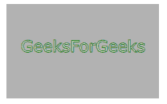
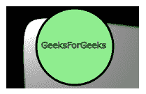

# SVG `<feFlood>`元素

> 原文:[https://www.geeksforgeeks.org/svg-feflood-element/](https://www.geeksforgeeks.org/svg-feflood-element/)

SVG 代表可缩放矢量图形。它可以用来制作像在 HTML 画布中的图形和动画。SVG `<strong>` < feFlood >元素生成一层连续的颜色，完全填充这个元素的滤镜原始区域。

**语法:**

```html
<feFlood x="" y="" width="" height=""
 flood-color="" flood-opacity=""/>
```

**语法:**

*   **x，y**–定义用户坐标系中的 x 轴和 y 轴坐标。
*   **宽度**–foreignObject 的宽度。
*   **高度**–物体的高度。
*   **泛色**–告知新图层的颜色。
*   **泛光-不透明度**–告知新图层的不透明度值。

**例 1:**

```html
<!DOCTYPE html>
<html>

<body>
    <svg width="200" height="200">
        <defs>
            <filter id="filter1" 
                filterUnits="userSpaceOnUse">

                <feFlood x="5%" y="5%" width="198" 
                height="118" flood-color="shadow" 
                flood-opacity="0.3" />
            </filter>
        </defs>

        <rect x="1" y="1" width="198" 
            height="118" style="stroke: #000000;
                         fill: red; 
                         filter: url(#filter1);" />

        <g fill="#FFFFFF" stroke="Green" 
            font-size="20" font-family="Verdana">
            <text x="28" y="70">GeeksForGeeks</text>
        </g>
    </svg>
</body>

</html>
```

**输出:**



**例 2:**

```html
<!DOCTYPE html>
<html>
<title>SVG Filter</title>

<body>
    <svg width="200" height="200">
        <defs>
            <filter id="filter1" 
                filterUnits="userSpaceOnUse">

                <feFlood x="5%" y="5%" width="198" 
                    height="118" flood-color="green" 
                    flood-opacity="0.7" />

                <feDiffuseLighting in="BackgroundImage" 
                    surfaceScale="14" diffuseConstant="2" 
                    kernelUnitLength="2">

                    <feSpotLight x="30" y="20" z="30" 
                        limitingConeAngle="40" 
                        pointsAtX="200" pointsAtY="200"
                        pointsAtZ="0" />

                    <fePointLight x="100" y="80" z="40" />
                </feDiffuseLighting>
            </filter>
        </defs>

        <rect x="2" y="1" width="198" height="118" 
                        style="stroke: #000000; 
                        fill: green;
                        filter: url(#filter1);" />

        <circle cx="108" cy="68" r="55" stroke="black" 
            stroke-width="3" fill="lightgreen" 
            filter: url(#filter1) />

        <g fill="#FFFFFF" stroke="darkGreen" 
            font-size="12" font-family="Verdana">
            <text x="60" y="70">GeeksForGeeks</text>
        </g>
    </svg>
</body>

</html>
```

**输出:**

