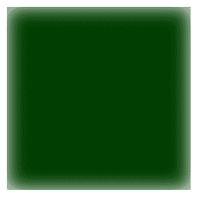
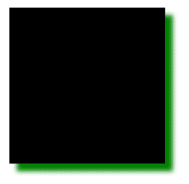

# SVG `<feGaussianBlur>`元素

> 原文:[https://www.geeksforgeeks.org/svg-fegaussianblur-element/](https://www.geeksforgeeks.org/svg-fegaussianblur-element/)

SVG 代表可缩放矢量图形。它可以用来制作像在 HTML 画布中的图形和动画。
**<fegaussianbull>**元素基于输入图元中提供的标准偏差为图形添加平滑模糊。

**语法:**

```html
<feGaussianBlur in="" stdDeviation="" edgeMode=""/> 
```

**属性:**

*   中的**属性**中的**标识给定过滤器原语的输入。**
*   **标准差:**定义平滑模糊操作的标准差。默认值为 **0。**
*   **边缘模式:**表示输入图层边缘的额外像素。

**例 1:**

## 超文本标记语言

```html
<!DOCTYPE html>
<html>

<body>
    <svg viewBox="0 0 1000 1000">
        <filter id="lightMe2">

            <feGaussianBlur in="FillPaint" 
                stdDeviation="10" edgeMode="wrap" />

            <feComposite in="SourceGraphic" 
                in2="light" operator="arithmetic" 
                k1="1" k2="0" k3="0" k4="0" />

        </filter>
        <rect x="20" y="20" width="200" 
            height="200" fill="green" 
            style="filter: url(#lightMe2);" />
    </svg>
</body>

</html>
```

**输出:**



**例 2:**

## 超文本标记语言

```html
<!DOCTYPE html>
<html>

<body>
    <svg viewBox="0 0 1000 1000">
        <filter id="lightMe3" x="-50"
            y="-40" width="200" height="150">

            <feOffset in="BackgroundImage" 
                    dx="10" dy="10" />

            <feGaussianBlur in="offset2" 
                    stdDeviation="3" />

            <feMerge>
                <feMergeNode in="blur" />
                <feMergeNode in="SourceAlpha" />
            </feMerge>

        </filter>
        <rect x="20" y="20" width="200" 
            height="200" fill="green" 
            style="filter: url(#lightMe3);" />
    </svg>
</body>

</html>
```

**输出:**

