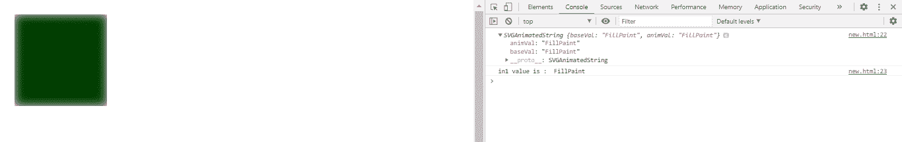
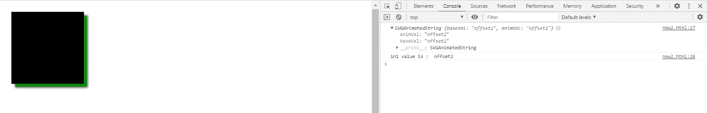

# SVG fegaussionbull . in1 属性

> 原文:[https://www . geesforgeks . org/SVG-fegaussionbulr-in1-property/](https://www.geeksforgeeks.org/svg-fegaussionblur-in1-property/)

**SVG fegaussionbull . in1 属性 r** 返回对应于 fegaussionbull . in1元素的 in1 组件的 SVGAnimatedString 对象。

**语法:**

```html
var a = FEGaussionBlur.in1
```

**返回值:**该属性返回对应于 fegaussionbull . in1元素的 in1 组件的 SVGAnimatedString 对象。

**例 1:**

## 超文本标记语言

```html
<!DOCTYPE html>
<html>

<body>
    <svg viewBox="0 0 1000 1000">
        <filter id="lightMe2">

            <feGaussianBlur in="FillPaint" 
                stdDeviation="10" edgeMode="wrap"
                id="gfg" />

            <feComposite in="SourceGraphic" 
                in2="light" operator="arithmetic"
                k1="1" k2="0" k3="0" k4="0" />
        </filter>

        <rect x="20" y="20" width="200" 
            height="200" fill="green" 
            style="filter: url(#lightMe2);" />

        <script type="text/javascript">
            var g = document.getElementById("gfg");
            console.log(g.in1);
            console.log("in1 value is : ", g.in1.baseVal)
        </script>
    </svg>
</body>

</html>
```

**输出:**



**例 2:**

## 超文本标记语言

```html
<!DOCTYPE html>
<html>

<body>
    <svg viewBox="0 0 1000 1000">
        <filter id="lightMe3" x="-50" y="-40" 
            width="200" height="150">

            <feOffset in="BackgroundImage" 
                dx="10" dy="10" />

            <feGaussianBlur in="offset2" 
                stdDeviation="3" id="gfg" />

            <feMerge>
                <feMergeNode in="blur" />
                <feMergeNode in="SourceAlpha" />
            </feMerge>
        </filter>

        <rect x="20" y="20" width="200" 
            height="200" fill="green" 
            style="filter: url(#lightMe3);" />

        <script type="text/javascript">
            var g = document.getElementById("gfg");
            console.log(g.in1);

            console.log("in1 value is : ", g.in1.baseVal)
        </script>
    </svg>
</body>

</html>
```

**输出:**



**支持的浏览器:**

*   谷歌 Chrome
*   边缘
*   火狐浏览器
*   旅行队
*   歌剧