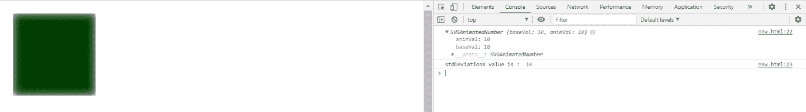
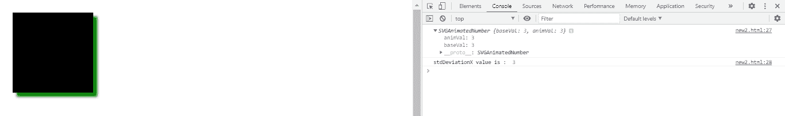

# SVG fegaussionbull . stddeviationx 属性

> 原文:[https://www . geesforgeks . org/SVG-fegaussionbulr-stddeviationx-property/](https://www.geeksforgeeks.org/svg-fegaussionblur-stddeviationx-property/)

**SVG fegaussionbull . stdDeviationX 属性**返回与 fegaussionbull . stddeviation x 元素的 stddeviation x 组件对应的 SVGAnimatedNumber 对象。

**语法:**

```html
var a = FEGaussionBlur.stdDeviationX
```

**返回值:**该属性返回对应于 FEGaussionBlur.stdDeviationX 元素的 stdDeviationX 组件的 SVGAnimatedNumber 对象

**例 1:**

```html
<!DOCTYPE html> 
<html> 

<body> 
    <svg viewBox="0 0 1000 1000"> 
        <filter id="lightMe2"> 

            <feGaussianBlur in="FillPaint"
                stdDeviation="10" edgeMode="wrap" id="gfg" /> 

            <feComposite in="SourceGraphic"
                in2="light" operator="arithmetic"
                k1="1" k2="0" k3="0" k4="0" /> 

        </filter> 
        <rect x="20" y="20" width="200"
            height="200" fill="green"
            style="filter: url(#lightMe2);" /> 

        <script type="text/javascript">
                var g = document.getElementById("gfg");
                console.log(g.stdDeviationX)
                console.log("stdDeviationX value is : "
      , g.stdDeviationX.baseVal)
        </script>

    </svg> 
</body> 

</html> 
```

**输出:**



**例 2:**

```html
<!DOCTYPE html> 
<html> 

<body> 
    <svg viewBox="0 0 1000 1000"> 
        <filter id="lightMe3" x="-50"
            y="-40" width="200" height="150"> 

            <feOffset in="BackgroundImage"
                    dx="10" dy="10" /> 

            <feGaussianBlur in="offset2"
                    stdDeviation="3" id="gfg"/> 

            <feMerge> 
                <feMergeNode in="blur" /> 
                <feMergeNode in="SourceAlpha" /> 
            </feMerge> 

        </filter> 
        <rect x="20" y="20" width="200"
            height="200" fill="green"
            style="filter: url(#lightMe3);" /> 

        <script type="text/javascript">
                var g = document.getElementById("gfg");
                console.log(g.stdDeviationX)
                console.log("stdDeviationX value is : "
             , g.stdDeviationX.baseVal)
        </script>

    </svg> 
</body> 

</html> 
```

**输出:**



**支持的浏览器:**

*   谷歌 Chrome
*   边缘
*   火狐浏览器
*   旅行队
*   歌剧